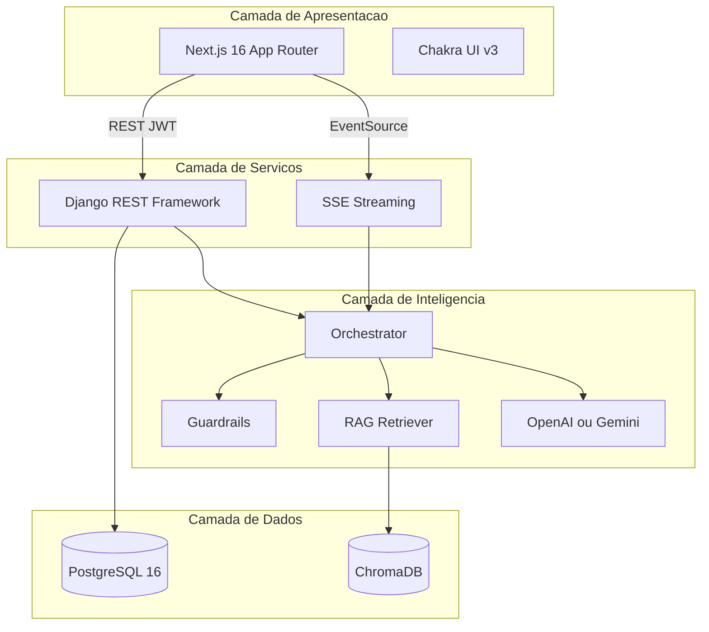

# Sistema Inteligente de Apoio à Longevidade e Bem-Estar

**Produto entregue:** MediClaw — Assistente de saúde

**Título acadêmico:** Implementação de uma Arquitetura Baseada em LLM e RAG para Apoio à Decisão em Saúde Preventiva e Clínica

**Integrantes:** Adriano Soares; Júlio César Batista Pires; Luciano Antônio Cordeiro de Sousa; Mara Joziclea Pereira; Pedro Ramos Krauze Diehl

---

## Resumo executivo

Este trabalho apresenta o **MediClaw**, plataforma web de apoio à decisão em saúde construída sobre uma arquitetura de **Large Language Models (LLMs)** acoplada a **Retrieval-Augmented Generation (RAG)**. A proposta inicial visava orientar indivíduos na interpretação de dados biométricos e hábitos relacionados à longevidade; durante o desenvolvimento, o escopo evoluiu para um **sistema de apoio clínico orientado ao médico**, no qual o profissional de saúde interage com um assistente de IA durante o atendimento, registra dados de pacientes de forma conversacional e consulta evidências indexadas em base de conhecimento proprietária.

A solução foi implementada como aplicação **full-stack**: frontend em **Next.js 16** com **Chakra UI v3**, backend em **Django 5.2** com **Django REST Framework**, persistência relacional em **PostgreSQL 16** e armazenamento vetorial em **ChromaDB**. A camada de inteligência artificial integra provedores **OpenAI** ou **Google Gemini**, pipeline RAG via **LangChain**, guardrails determinísticos em português e skills clínicas auxiliares (cálculo de IMC, conversão de unidades, agregação de histórico de saúde). Foram entregues autenticação JWT, chat com streaming SSE, gestão de pacientes, base de conhecimento compartilhada e painel administrativo de métricas, com **137 testes automatizados no backend** e **aproximadamente 40 no frontend**. Limitações reconhecidas incluem guardrails baseados em expressões regulares, trilha de auditoria ainda não persistida e dependência de APIs externas de LLM.

---

## Sumário

1. [Introdução e contextualização](#1-introdução-e-contextualização)
2. [Problema de pesquisa](#2-problema-de-pesquisa)
3. [Objetivos](#3-objetivos)
4. [Evolução metodológica e pivot arquitetural](#4-evolução-metodológica-e-pivot-arquitetural)
5. [Arquitetura da solução](#5-arquitetura-da-solução)
6. [Stack tecnológico e bibliotecas](#6-stack-tecnológico-e-bibliotecas)
7. [Funcionalidades implementadas](#7-funcionalidades-implementadas)
8. [Abordagens e padrões de engenharia](#8-abordagens-e-padrões-de-engenharia)
9. [Camada de inteligência artificial](#9-camada-de-inteligência-artificial)
10. [Segurança, ética e responsabilidade clínica](#10-segurança-ética-e-responsabilidade-clínica)
11. [Metodologia de desenvolvimento](#11-metodologia-de-desenvolvimento)
12. [Avaliação e evidências de qualidade](#12-avaliação-e-evidências-de-qualidade)
13. [Limitações do trabalho](#13-limitações-do-trabalho)
14. [Trabalhos futuros](#14-trabalhos-futuros)
15. [Instalação e reprodutibilidade](#15-instalação-e-reprodutibilidade)
16. [Estrutura do repositório](#16-estrutura-do-repositório)
17. [Referências](#17-referências)

---

## 1. Introdução e contextualização

O envelhecimento populacional e a crescente disponibilidade de dados de saúde — biométricos, hábitos de vida, registros clínicos e literatura científica — ampliaram a demanda por ferramentas capazes de **transformar informação em orientação acionável**. Paralelamente, os avanços em modelos de linguagem de grande escala (LLMs) abriram possibilidades inéditas para sistemas conversacionais que sintetizam conhecimento, contextualizam casos individuais e apoiam a raciocinação clínica.

Neste contexto, desenvolveu-se o **MediClaw**, sistema web cujo propósito é **auxiliar profissionais de saúde** na condução de atendimentos preventivos e clínicos, oferecendo hipóteses diferenciais, sugestões de investigação e referências a evidências indexadas. O sistema **não substitui** avaliação, diagnóstico ou tratamento por profissional habilitado; trata-se explicitamente de **ferramenta de apoio à decisão clínica (CDSS)**, com disclaimers visíveis e guardrails que restringem condutas de risco (prescrições, diagnósticos fechados, respostas a urgências simuladas).

A presente documentação descreve a intenção original do projeto, as decisões tomadas durante a implementação, a arquitetura técnica adotada e o conjunto de funcionalidades efetivamente entregues, servindo como **documento de entrega** de atividade de pós-graduação.

---

## 2. Problema de pesquisa

A lacuna entre a **coleta de dados de saúde** e a **ação prática** permanece significativa, especialmente quando se considera:

| Dimensão | Descrição |
|----------|-----------|
| **Complexidade de interpretação** | Dados de exames, sinais vitais e rotinas de vida são técnicos, fragmentados e difíceis de integrar sem expertise clínica ou estatística. |
| **Generalismo das recomendações** | Orientações genéricas de bem-estar frequentemente ignoram a individualidade biológica, comorbidades e contexto de vida do indivíduo. |
| **Acesso limitado a expertise** | Consultoria contínua com especialistas em longevidade ou medicina personalizada impõe barreiras financeiras e de tempo, sobretudo fora de grandes centros urbanos. |

A hipótese central do trabalho é que uma arquitetura combinando **LLM + RAG + guardrails determinísticos**, operando sobre dados estruturados do paciente e literatura curada, pode **reduzir essa lacuna** ao oferecer suporte contextualizado, rastreável e eticamente delimitado ao profissional de saúde.

---

## 3. Objetivos

### 3.1 Objetivo geral

Desenvolver uma plataforma inteligente que ofereça **suporte à decisão** em saúde preventiva e clínica, integrando persistência de dados, autenticação segura e camada de inteligência artificial com embasamento em evidências.

### 3.2 Objetivos específicos e status de entrega

| Objetivo específico | Status | Evidência |
|---------------------|--------|-----------|
| Arquitetar backend robusto em Django para gestão de dados e autenticação | **Concluído** | [`django-api/`](django-api/) — apps modulares, JWT, PostgreSQL |
| Implementar camada de IA com LLMs configuráveis (OpenAI/Gemini) | **Concluído** | `apps/ai_engine/` — orquestrador, providers, streaming SSE |
| Integrar mecanismos de RAG para embasamento em documentos científicos | **Concluído** | `apps/rag/` — ChromaDB, ingestão PDF/TXT/MD, retriever semântico |
| Estabelecer guardrails éticos (anti-diagnóstico, anti-prescrição) | **Concluído** | `apps/ai_engine/guardrails.py` — filtros pré e pós-LLM |
| Desenvolver interface web de chat e dashboards de saúde | **Concluído** | [`react-painel/`](react-painel/) — Next.js, chat SSE, pacientes, conhecimento |
| Implementar skills auxiliares (IMC, conversão de unidades) | **Concluído** | `apps/ai_engine/skills/` |
| Captura conversacional de dados clínicos | **Concluído** | `apps/ai_engine/services/user_data_capture.py` |
| Hardening de produção, auditoria persistente e testes E2E | **Pendente (E7)** | Trilha de audit stub; roadmap documentado |

---

## 4. Evolução metodológica e pivot arquitetural

### 4.1 Fase proposta (wellness e longevidade)

A proposta inicial descrevia uma plataforma voltada ao **usuário final** (indivíduo), com foco em longevidade e bem-estar. Previam-se formulários manuais para registro de peso, sono, atividade e nutrição, perfil biométrico preenchido pelo próprio usuário e recomendações personalizadas de saúde preventiva.

### 4.2 Fase implementada (apoio clínico ao médico)

Durante a implementação, identificou-se que o domínio clínico exige **delimitação mais rigorosa de responsabilidade**, **modelo de dados centrado no paciente-atendido** (e não no profissional como paciente) e **interlocutor explícito** (médico, não paciente). O sistema evoluiu para:

- **Interlocutor:** médico autenticado, que descreve o paciente em linguagem natural durante a consulta.
- **Entidade central:** `Patient`, sub-registro vinculado ao médico (`doctor` FK).
- **Captura de dados:** automática a partir das mensagens de chat (regex + LLM opcional), sem formulários manuais no frontend.
- **Prompts:** redigidos em português, em tom colegial, referindo o paciente sempre em terceira pessoa.
- **Guardrails:** bloqueio de pedidos de diagnóstico definitivo, prescrição e padrões de urgência simulada.

### 4.3 Justificativas do pivot

1. **Coerência ético-legal:** CDSS orientado ao médico alinha-se melhor à responsabilidade clínica e aos disclaimers exigidos.
2. **Modelo de dados:** separar `User` (profissional) de `Patient` (atendido) evita ambiguidade semântica nos logs de saúde.
3. **Experiência de uso:** captura conversacional reduz fricção durante o atendimento e aproxima o fluxo de prontuário narrativo.
4. **Testabilidade:** guardrails e prompts ficam mais auditáveis quando o interlocutor é único e conhecido.

### 4.4 Tabela comparativa: proposto vs. entregue

| Aspecto | Proposta original | Implementação entregue |
|---------|-------------------|------------------------|
| Público-alvo | Indivíduo / usuário final | Médico / profissional de saúde |
| Entrada de dados | Formulários manuais de logs | Captura conversacional via chat |
| Frontend | React (genérico) | Next.js 16 + Chakra UI v3 |
| Vector store | ChromaDB ou Pinecone | ChromaDB local (persistência em disco) |
| Provedor LLM | OpenAI / Anthropic | OpenAI / Google Gemini |
| Base de conhecimento | Curada por admin | Compartilhada entre usuários autenticados |
| Posicionamento | Bem-estar / longevidade | Apoio à decisão clínica (CDSS) |

---

## 5. Arquitetura da solução

O sistema adota arquitetura **cliente-servidor em três camadas**, com desacoplamento entre apresentação (Next.js), serviços (Django/DRF) e inteligência (orquestrador + RAG + LLM).



### 5.1 Módulos backend (monolito modular)

| App Django | Responsabilidade |
|------------|------------------|
| `config` | Settings, URLs, WSGI/ASGI |
| `common` | Envelope API, exceções, permissões, healthcheck, middleware |
| `accounts` | Usuário customizado (email), JWT, registro, perfil |
| `patients` | Registros de pacientes vinculados ao médico |
| `health_logs` | Logs de peso, sono, atividade e nutrição por paciente |
| `conversations` | Threads de chat, mensagens, streaming SSE |
| `ai_engine` | Orquestrador, guardrails, prompts, skills, captura de dados |
| `rag` | Ingestão, indexação ChromaDB, retriever semântico |
| `audit` | Endpoints admin e stub de auditoria (E7 pendente) |

### 5.2 Módulos frontend

| Camada | Responsabilidade |
|--------|------------------|
| `src/app/` | Rotas App Router: landing, auth, chat, pacientes, conhecimento, admin |
| `src/components/` | UI por domínio (auth, chat, patients, layout) |
| `src/hooks/` | Estado e fetch por domínio (`useConversations`, `usePatients`, etc.) |
| `src/context/` | Autenticação global e notificações toast |
| `src/lib/` | Cliente Axios (JWT), wrapper SSE, utilitários de disclaimer |

### 5.3 Contrato de comunicação

Todas as respostas REST seguem envelope padronizado:

```json
{
  "data": { "...": "..." },
  "error": null,
  "meta": { "total": 10, "page": 1 }
}
```

O chat utiliza **Server-Sent Events (SSE)** para streaming de tokens, citações RAG e metadados de conclusão (`tokens_used`, `blocked`, `patient_id`).

Documentação técnica detalhada: [`django-api/specs/ARCHITECTURE.md`](django-api/specs/ARCHITECTURE.md), [`react-painel/specs/ARCHITECTURE.md`](react-painel/specs/ARCHITECTURE.md).

---

## 6. Stack tecnológico e bibliotecas

### 6.1 Frontend — [`react-painel/package.json`](react-painel/package.json)

| Categoria | Tecnologia | Versão | Papel |
|-----------|------------|--------|-------|
| Framework | Next.js (App Router) | 16.2.4 | Roteamento, build, SSR de shell |
| UI | React | 19.2.4 | Biblioteca de componentes |
| Linguagem | TypeScript | ^5 | Tipagem estática |
| Design system | Chakra UI | ^3.35.0 | Componentes acessíveis |
| Estilização | Emotion | ^11.14.0 | CSS-in-JS (peer do Chakra) |
| HTTP | Axios | ^1.15.2 | Cliente REST com interceptors JWT |
| Markdown | react-markdown + remark-gfm | ^10.1.0 / ^4.0.1 | Renderização de respostas da IA |
| Testes | Vitest + Testing Library | ^4.1.7 | Testes unitários e de componente |
| Qualidade | ESLint, Prettier, Husky | — | Lint, formatação, pre-commit hooks |

### 6.2 Backend — [`django-api/pyproject.toml`](django-api/pyproject.toml)

| Categoria | Tecnologia | Versão | Papel |
|-----------|------------|--------|-------|
| Runtime | Python | ≥ 3.12 | Linguagem base |
| Framework web | Django | 5.2.1 | ORM, admin, migrations |
| API | Django REST Framework | 3.16.0 | Serializers, views, throttling |
| Autenticação | djangorestframework-simplejwt | 5.5.0 | JWT access/refresh |
| Banco relacional | PostgreSQL + psycopg | 3.2.13 | Persistência de domínio |
| CORS | django-cors-headers | 4.7.0 | Comunicação cross-origin com frontend |
| LLM | openai, google-genai | ≥ 1.30 / ≥ 1.0 | Provedores configuráveis |
| Orquestração IA | langchain + integrações | 0.3.* | Splitters, embeddings, retrievers |
| Vector store | chromadb | 0.5.* | Armazenamento e busca vetorial |
| PDF | pypdf | ≥ 4.0 | Extração de texto para RAG |
| Validação | pydantic | ≥ 2.7 | Modelos de captura e skills |
| Documentação API | drf-yasg | 1.21.15 | Swagger / ReDoc |
| Servidor ASGI | uvicorn | ≥ 0.30 | Suporte a SSE |
| Testes | pytest + pytest-django + freezegun | 8.* / 4.* | Suite automatizada |
| Formatação | black, pre-commit | 25.1.0 / 4.2.0 | Padronização de código |

---

## 7. Funcionalidades implementadas

### 7.1 Autenticação e gestão de usuários

| Funcionalidade | Frontend | Backend |
|----------------|----------|---------|
| Registro com aceite de termos | `/register` | `POST /api/v1/auth/register/` |
| Login email/senha | `/login` | `POST /api/v1/auth/login/` |
| Refresh de token JWT | Automático (Axios interceptor) | `POST /api/v1/auth/refresh/` |
| Perfil do usuário | TopBar (nome, logout) | `GET/PATCH /api/v1/auth/me/` |
| Papéis USER / ADMIN | Guards `RequireAdmin` | `User.role`, `IsAdminRole` |

Política de senha: mínimo 8 caracteres, letra e número.

### 7.2 Chat com inteligência artificial

| Funcionalidade | Descrição |
|----------------|-----------|
| Lista de conversas | Paginação, criação e exclusão (`/chat`) |
| Interface de chat | Histórico de mensagens + input com streaming (`/chat/[id]`) |
| Streaming SSE | Tokens incrementais, citações RAG, evento `done` com metadados |
| Mensagem de boas-vindas | Orientação inicial ao médico sobre uso do assistente |
| Atribuição de fontes | Distinção entre evidência interna (KB) e conhecimento geral do modelo |
| Disclaimer ético | Exibido em toda resposta clínica; deduplicação no frontend |
| Indicador de guardrail | Badge "Resposta limitada" quando `blocked_by_guardrail=true` |
| Identificação de paciente | Backend retorna `patient_id` quando dados são capturados na conversa |

### 7.3 Gestão de pacientes e histórico de saúde

| Funcionalidade | Descrição |
|----------------|-----------|
| Lista de pacientes | Nome, último atendimento, consultas, peso, IMC (`/patients`) |
| Detalhe do paciente | Dados demográficos, IMC categorizado, consultas vinculadas (`/patients/[id]`) |
| Histórico de saúde | Abas: peso, sono, atividade, nutrição (somente leitura no frontend) |
| CRUD backend | Endpoints REST com escopo por médico (`patient_id` obrigatório) |
| Resumo agregado | `GET /api/v1/health/summary/?patient_id=&window=7\|30` |

Dados biométricos são **persistidos automaticamente** quando o médico os menciona no chat; não há formulários manuais de entrada no frontend (Epic 3 descontinuado).

### 7.4 Base de conhecimento (RAG)

| Funcionalidade | Descrição |
|----------------|-----------|
| Upload de documentos | PDF, TXT, MD até 10 MB (`/conhecimento`) |
| Indexação | Chunking (1000 chars, overlap 200), embeddings OpenAI, ChromaDB |
| Listagem e exclusão | Tabela com status (PROCESSING / INDEXED / ERROR) |
| Recuperação semântica | Top-K com threshold `RAG_MIN_SCORE` (default 0.75) |
| Coleção compartilhada | `mediclaw_kb` — qualquer usuário autenticado pode curar |

### 7.5 Administração

| Funcionalidade | Descrição |
|----------------|-----------|
| Métricas da plataforma | `/admin/metrics` — conversas, mensagens, tokens, bloqueios de guardrail |
| Criação de usuários admin | `POST /api/v1/admin/users/` (role ADMIN) |

### 7.6 Interface do sistema

Capturas de tela da aplicação em execução local (`http://localhost:3000`):

**Landing page pública** — apresentação do MediClaw, features e call-to-action para cadastro.


**Tela de login** — autenticação por e-mail e senha com link para registro.


**Tela de registro** — criação de conta com validação de senha e aceite de termos.


**Lista de conversas** — histórico de chats do médico, com opção de nova conversa e exclusão.


**Chat com IA** — resposta estruturada com recomendações clínicas, disclaimer e atribuição de fonte.


**Lista de pacientes** — visão tabular com métricas de IMC e frequência de atendimento.


**Detalhe do paciente** — perfil demográfico, consultas e histórico de saúde por categoria.


---

## 8. Abordagens e padrões de engenharia

### 8.1 Backend

| Padrão | Implementação | Benefício |
|--------|---------------|-----------|
| **Monolito modular** | Apps Django por domínio (`patients`, `rag`, `ai_engine`, etc.) | Coesão, deploy único, fronteiras claras |
| **Service layer** | `*/services/*.py` (ex.: `chat.py`, `aggregate.py`, `persist.py`) | Views finas; lógica testável isoladamente |
| **Provider pattern** | `LLMProvider` em `providers/base.py` | Troca OpenAI ↔ Gemini via variável de ambiente |
| **Envelope API** | `common/renderers.py` | Contrato uniforme para o frontend |
| **Multi-tenancy por médico** | Querysets filtrados por `doctor=request.user` | Isolamento de dados sensíveis |
| **Exceções estruturadas** | `AppError` com `{code, message, details}` | Erros previsíveis para o cliente |

### 8.2 Frontend

| Padrão | Implementação | Benefício |
|--------|---------------|-----------|
| **App Router com route groups** | `(auth)` público, `(app)` protegido | Separação clara de guards |
| **Client-side fetching** | Hooks + Axios; sem Server Components de negócio | Simplicidade; paridade com eventual app mobile |
| **Context API** | `AuthContext`, `ToastContext` | Estado global mínimo sem Redux |
| **Hooks de domínio** | `useConversations`, `useMessages`, `usePatients`, `useKnowledge` | Encapsulamento de fetch e estado local |
| **Guards de rota** | `RequireAuth`, `RequireAdmin`, `GuestOnly` | Proteção declarativa |
| **SSE wrapper** | `lib/sse.ts` com callbacks tipados | Abstração sobre `EventSource` nativo |

Decisões arquiteturais formalizadas nos ADRs: [`django-api/specs/ARCHITECTURE.md`](django-api/specs/ARCHITECTURE.md), [`react-painel/specs/ARCHITECTURE.md`](react-painel/specs/ARCHITECTURE.md).

---

## 9. Camada de inteligência artificial

### 9.1 Pipeline de geração

O orquestrador (`apps/ai_engine/orchestrator.py`) executa o seguinte fluxo para cada mensagem:

```
Entrada do médico
    │
    ▼
Guardrail pré-LLM (check_input)
    │── bloqueado → resposta canned + disclaimer (sem chamada LLM)
    ▼
Captura conversacional de dados (regex + LLM opcional)
    │
    ▼
Busca RAG (ChromaDB, top-K, score mínimo)
    │
    ▼
Agregação de histórico de saúde do paciente (health_summary)
    │
    ▼
Montagem do system prompt (prompts.py)
    │
    ▼
Chamada ao LLM (stream ou síncrono)
    │
    ▼
Guardrail pós-LLM (check_output)
    │
    ▼
Append do DISCLAIMER obrigatório
    │
    ▼
Resposta final (+ citações, metadados, flags)
```

### 9.2 Prompt engineering

O system prompt (`SYSTEM_PROMPT_TEMPLATE`) instrui o modelo a:

- Tratar o médico como colega, em português clínico objetivo.
- Referir-se ao paciente sempre em **terceira pessoa**.
- Oferecer **hipóteses diferenciais** e condutas sugeridas com linguagem de apoio ("considerar...", "avaliar...").
- **Nunca** prescrever medicamentos, doses ou diagnósticos fechados.
- Usar **apenas** o contexto RAG para afirmações técnicas, citando fontes.
- Priorizar alertas de urgência quando sintomas críticos forem descritos.

Modos adicionais: **onboarding** (coleta de dados básicos faltantes) e **soft appendix** (lembrete não bloqueante).

### 9.3 Guardrails determinísticos

Implementados em `guardrails.py` via expressões regulares em português:

| Fase | Bloqueia |
|------|----------|
| **Entrada** | Urgência simulada, pedidos de diagnóstico, pedidos de prescrição, gibberish |
| **Saída** | Diagnósticos definitivos, instruções de dosagem ("tome X mg") |

Respostas bloqueadas retornam mensagens padronizadas e registram `blocked_by_guardrail=true` no modelo `Message`.

### 9.4 RAG (Retrieval-Augmented Generation)

| Etapa | Detalhe |
|-------|---------|
| Ingestão | Upload → extração de texto → chunking → embedding → ChromaDB |
| Embedding | OpenAI `text-embedding-3-small` |
| Coleção | `mediclaw_kb` (persistência local configurável) |
| Recuperação | Similaridade coseno; filtro por `RAG_MIN_SCORE` e `RAG_TOP_K` |
| Citações | Injetadas no prompt e emitidas via SSE (`event: citation`) |

### 9.5 Skills auxiliares

Funções Python determinísticas injetadas no contexto do prompt (não tool-calling nativo do LLM):

| Skill | Arquivo | Função |
|-------|---------|--------|
| BMI | `skills/bmi.py` | Cálculo e categorização WHO |
| Conversão de unidades | `skills/unit_convert.py` | kg↔lb, cm↔in, ml↔fl_oz |
| Resumo de saúde | `skills/health_summary.py` | Agregação de logs recentes |
| Prontidão do perfil | `skills/user_readiness.py` | Campos faltantes do paciente |

### 9.6 Captura conversacional de dados

`user_data_capture.py` implementa pipeline em três estágios:

1. **Keyword gate** — verifica se a mensagem contém padrões capturáveis.
2. **Parse regex** — extrai nome, altura, peso, sono, atividade, nutrição.
3. **Fallback LLM** — opcional (`DATA_CAPTURE_LLM=true`) para casos ambíguos.

Dados persistidos criam ou atualizam `Patient` e registram logs em `health_logs`.

---

## 10. Segurança, ética e responsabilidade clínica

### 10.1 Mecanismos de segurança

| Controle | Implementação |
|----------|---------------|
| Autenticação | JWT Bearer (access 30 min, refresh 1 dia) |
| Autorização | Isolamento por médico; endpoints admin com `IsAdminRole` |
| Rate limiting | Anônimo 30/min, usuário 60/min, chat 10/min |
| CORS | Origens explícitas via `CORS_ALLOWED_ORIGINS` |
| Senha | Validação mínima (8 chars, letra + número) |
| Termos de uso | `accepted_terms_at` obrigatório no registro |
| Upload | Limite 10 MB; MIME whitelist (PDF, TXT, MD) |
| Limite de conversa | Máximo 50 mensagens por thread |
| Request tracing | `RequestIDMiddleware` para correlação de logs |

### 10.2 Framework ético

1. **Posicionamento explícito:** apoio à decisão clínica; responsabilidade permanece com o médico assistente.
2. **Disclaimer obrigatório** em toda resposta clínica:

   > *Conteúdo de apoio à decisão clínica com base em evidências disponíveis; a avaliação, conduta e responsabilidade são do médico assistente.*

3. **Guardrails pré e pós-LLM** para bloquear condutas de alto risco.
4. **Transparência no frontend:** citações de fonte, indicador de bloqueio, disclaimer visível.
5. **Prompt constraints:** proibição de prescrição, diagnóstico fechado e invenção de fontes.

### 10.3 Limitações éticas reconhecidas

- Guardrails baseados em regex são **bypassáveis** por paráfrases; não substituem julgamento clínico.
- Trilha de auditoria (`apps/audit/`) é **stub** — eventos não são persistidos em banco dedicado (E7).
- Token JWT transmitido via **query string** no SSE (limitação do `EventSource`) expõe credencial em logs de proxy.

---

## 11. Metodologia de desenvolvimento

O projeto seguiu **desenvolvimento iterativo incremental**, organizado em épicos (E1–E7), com entregas validadas por testes automatizados a cada ciclo.

| Epic | Escopo | Status |
|------|--------|--------|
| **E1 — Foundation** | Settings, logging JSON, healthcheck, CI, middlewares | Concluído |
| **E2 — Auth & Users** | JWT, registro, login, refresh, perfil | Concluído |
| **E3 — Health Logs** | CRUD peso/sono/atividade/nutrição + resumo | Concluído |
| **E4 — AI Engine** | Providers, guardrails, skills, orquestrador, stream | Concluído |
| **E5 — RAG** | Ingestão, ChromaDB, retriever, endpoints KB | Concluído |
| **E6 — Conversations** | CRUD conversas, SSE, boas-vindas, captura via chat | Concluído |
| **E7 — Hardening** | E2E, auditoria persistente, hardening produção | Pendente |

**Frontend (react-painel):** épicos 1 (foundation), 2 (auth), 4 (chat), 6 (admin/knowledge) concluídos; épicos 3 e 5 (formulários manuais de health/profile) descontinuados após pivot.

Roadmaps executáveis: [`django-api/specs/TASKS.md`](django-api/specs/TASKS.md), [`react-painel/specs/TASKS.md`](react-painel/specs/TASKS.md).

---

## 12. Avaliação e evidências de qualidade

### 12.1 Testes automatizados

| Camada | Framework | Volume | Comando |
|--------|-----------|--------|---------|
| Backend | pytest + pytest-django | **137 testes** | `pytest tests/ -v` |
| Frontend | Vitest + Testing Library | **~40 testes** | `npm test` |

### 12.2 Cobertura por domínio (backend)

| Módulo | Arquivo de testes | Foco |
|--------|-------------------|------|
| Autenticação | `tests/accounts/test_auth.py` | Registro, login, refresh, perfil |
| Guardrails | `tests/ai_engine/test_guardrails.py` | Bloqueios pré/pós, categorias PT-BR |
| Orquestrador | `tests/ai_engine/test_orchestrator.py` | Pipeline completo (LLM mockado) |
| Captura de dados | `tests/ai_engine/test_user_data_capture.py` | Regex, persistência, paciente |
| Skills | `tests/ai_engine/test_skills.py` | BMI, unidades, resumo |
| RAG | `tests/rag/test_*.py` | Ingestão, retriever, views |
| Conversas | `tests/conversations/test_*.py` | CRUD, boas-vindas, streaming |
| Health logs | `tests/health_logs/test_summary.py` | Agregação temporal |

LLM e RAG são **mockados nos testes** para reprodutibilidade e ausência de custo de API.

### 12.3 Testes frontend

Cobertura de formulários de auth, componentes de chat (input SSE, bubbles, disclaimer), layout e contexto de autenticação — `src/__tests__/`.

---

## 13. Limitações do trabalho

| Limitação | Impacto | Mitigação futura |
|-----------|---------|------------------|
| Guardrails por regex | Falsos negativos/positivos; bypass por paráfrase | Classificador ML dedicado (E7) |
| JWT em localStorage | Risco teórico de exfiltração via XSS | httpOnly cookies + proxy Next.js |
| Token SSE na query string | Exposição em logs de servidor/proxy | Token efêmero de curta duração ou WebSocket |
| Indexação RAG síncrona | Timeout em documentos grandes | Fila assíncrona (Celery/RQ) |
| Sem polling de status KB | UI não atualiza status PROCESSING automaticamente | Polling ou SSE admin (ADR-06 front) |
| Audit trail stub | Sem trilha forense persistente | Tabela de audit + retenção (E7) |
| Dependência de API externa | Custo, latência, indisponibilidade do provedor | Fallback multi-provider, modelos locais |
| ChromaDB single-node | Não escala horizontalmente | Migração para pgvector |
| Post-guardrail em stream | Tokens já exibidos antes de bloqueio pós-LLM | Buffer ou classificação pré-stream |

---

## 14. Trabalhos futuros

Derivados do roadmap E7 e dos ADRs documentados:

1. **Hardening de produção** — HTTPS obrigatório, secrets management, health checks avançados.
2. **Auditoria persistente** — registro de interações LLM, bloqueios de guardrail e uploads KB.
3. **Guardrails com ML** — classificador fine-tuned para intenção clínica de risco.
4. **pgvector** — unificar dados relacionais e vetoriais no PostgreSQL existente.
5. **Cookies httpOnly** — eliminar JWT de localStorage e query string SSE.
6. **App mobile** — reutilizar hooks e contrato REST/SSE existentes.
7. **Testes E2E** — Playwright/Cypress cobrindo fluxos críticos médico → chat → paciente.
8. **Internacionalização** — suporte multilíngue além do português atual.

---

## 15. Instalação e reprodutibilidade

### 15.0 Rodando com um único comando (recomendado)

Na raiz do repositório há um `Makefile` que sobe backend e frontend em paralelo:

```bash
# Na raiz do projeto
make dev       # sobe django-api (porta 8000) + react-painel (porta 3000)
make backend   # apenas o backend
make frontend  # apenas o frontend
```

> **Pré-requisito:** `make` disponível (padrão em macOS e Linux). No Windows, use WSL ou execute os serviços separadamente conforme as seções 15.2 e 15.3.

### 15.1 Pré-requisitos

- **Node.js** ≥ 20
- **Python** ≥ 3.12
- **PostgreSQL** 16
- Chave de API **OpenAI** ou **Google Gemini**

### 15.2 Backend (porta 8000)

```bash
cd django-api
uv sync
cp .env.example .env
# Editar .env: SECRET_KEY, DB_*, OPENAI_API_KEY, LLM_PROVIDER
uv run python manage.py migrate
uv run python manage.py runserver
```

Documentação completa: [`django-api/README.md`](django-api/README.md)

### 15.3 Frontend (porta 3000)

```bash
cd react-painel
cp .env.local.example .env.local
# NEXT_PUBLIC_API_URL=http://localhost:8000
npm install
npm run dev
```

Abrir `http://localhost:3000`. Documentação completa: [`react-painel/README.md`](react-painel/README.md)

### 15.4 Variáveis essenciais

| Variável | Onde | Descrição |
|----------|------|-----------|
| `OPENAI_API_KEY` | django-api `.env` | Chave para LLM e embeddings |
| `LLM_PROVIDER` | django-api `.env` | `openai` ou `gemini` |
| `DB_*` | django-api `.env` | Conexão PostgreSQL |
| `CHROMA_PERSIST_DIR` | django-api `.env` | Diretório de persistência ChromaDB |
| `NEXT_PUBLIC_API_URL` | react-painel `.env.local` | URL base do backend |

---

## 16. Estrutura do repositório

```
mediclaw/
├── README.md                 # Este documento (entrega acadêmica)
├── Makefile                  # Atalhos de desenvolvimento (make dev, make backend, make frontend)
├── docs/
│   └── screenshots/          # Capturas de tela da interface
├── django-api/               # Backend Django + DRF
│   ├── apps/                 # Módulos de domínio
│   ├── config/               # Settings e URLs
│   ├── tests/                # Suite pytest (137 testes)
│   ├── specs/                # PRD, arquitetura, épicos, tasks
│   └── README.md             # Setup técnico do backend
└── react-painel/             # Frontend Next.js
    ├── src/
    │   ├── app/              # Rotas App Router
    │   ├── components/       # UI por domínio
    │   ├── hooks/            # Hooks de fetch/estado
    │   ├── context/          # Auth e toast
    │   ├── lib/              # API, SSE, utilitários
    │   └── types/            # Tipos TypeScript da API
    ├── specs/                # PRD, arquitetura, ADRs
    └── README.md             # Setup técnico do frontend
```

---

## 17. Referências

1. LEWIS, P. et al. **Retrieval-Augmented Generation for Knowledge-Intensive NLP Tasks.** Advances in Neural Information Processing Systems (NeurIPS), 2020.

2. WORLD HEALTH ORGANIZATION. **Ethics and governance of artificial intelligence for health.** WHO Guidance, 2021.

3. TOPOL, E. J. **Deep Medicine: How Artificial Intelligence Can Make Healthcare Human Again.** Basic Books, 2019.

4. SUTTON, R. T. et al. **An overview of clinical decision support systems: advancing toward modern clinical decision support.** *Frontiers in Public Health*, 2020.

5. OPENAI. **GPT-4 Technical Report.** arXiv:2303.08774, 2023.

6. DJANGO SOFTWARE FOUNDATION; REACT TEAM. Documentação oficial de Django REST Framework, Next.js App Router e Server-Sent Events — consultadas para decisões arquiteturais registradas nos ADRs do projeto.

---

*Documento de entrega — MediClaw. Última atualização: maio/2026.*
