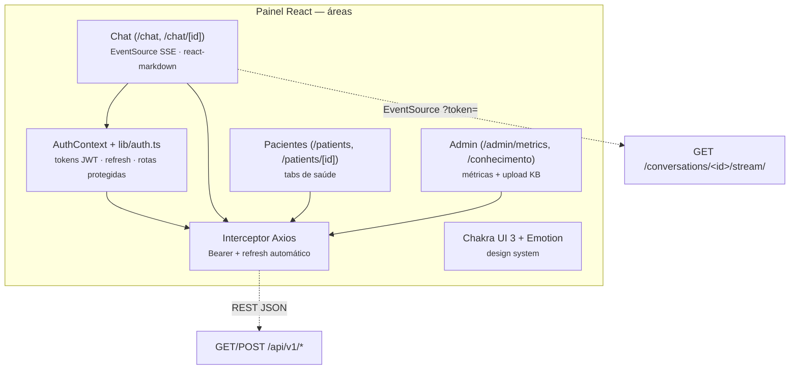
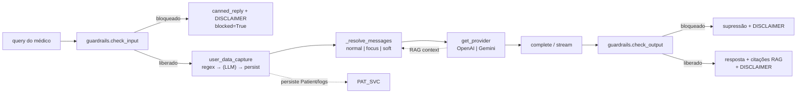

# Diagrama C4 — Componentes (Nível 3) — MediClaw

> Gerado pelo **Arquiteto** em 2026-08-19.
> Escala de confiança: 🟢 CONFIRMADO | 🟡 INFERIDO | 🔴 LACUNA
> Detalhamento dos containers mais relevantes: **API Django** (apps) e **Painel React** (áreas).

---

## 1. Componentes da API Django

```mermaid
flowchart TD
    subgraph API["API Django — apps"]
        subgraph Infra["apps/common (infra transversal)"]
            RENDERER["EnvelopeJSONRenderer"]
            HANDLER["envelope_exception_handler"]
            PERMS["IsAdminRole · IsOwner"]
            MW["RequestID · UserContext\nmiddlewares"]
            PAG["DefaultPagination"]
            LOG["structlog (get_logger)"]
            HEALTH["GET /health/"]
        end

        subgraph Accounts["apps/accounts"]
            AUTH_VIEWS["register · login · me\nadmin_create_user"]
            USER["User (custom, email login)"]
            WELCOME["ensure_welcome_conversation"]
        end

        subgraph Patients["apps/patients"]
            PAT_VIEWS["list · detail (GET/PATCH/DELETE)"]
            PAT_SVC["services/patient.py\nensure/resolve/merge"]
            PATIENT["Patient"]
        end

        subgraph Health["apps/health_logs"]
            LOG_VIEWS["ViewSets weight/sleep/activity/nutrition"]
            SUMMARY["GET /health/summary/"]
            PERSIST["services/persist.py"]
            AGG["services/aggregate.py"]
            WLOG["WeightLog"]; SLOG["SleepLog"]; ALOG["ActivityLog"]; NLOG["NutritionNote"]
        end

        subgraph Conv["apps/conversations"]
            CONV_VIEWS["list/detail/post_message"]
            STREAM["GET stream/ (SSE, view pura)"]
            CHAT_SVC["services/chat.py\nsend_message"]
            CONV["Conversation (soft-delete)"]
            MSG["Message (metadata JSON)"]
        end

        subgraph AI["apps/ai_engine"]
            ORCH["orchestrator\ngenerate/generate_stream"]
            GUARD["guardrails\ncheck_input/check_output"]
            CAPTURE["services/user_data_capture\nregex → LLM → persist"]
            PROV["providers\nOpenAI · Gemini"]
            SKILLS["skills: bmi · unit_convert\nhealth_summary · user_readiness"]
            PROMPTS["prompts (DISCLAIMER,\ntemplates onboarding)"]
        end

        subgraph RAG["apps/rag"]
            RAG_VIEWS["upload · list · status\ndelete · metrics"]
            INGEST["ingestion.py\nchunk + embed + Chroma"]
            RETRIEVER["retriever.search"]
            VS["vector_store\nget_collection"]
            KBDOC["KnowledgeDocument"]
        end

        subgraph Audit["apps/audit"]
            RECORD["record() — STUB pass"]
            ADMIN_URLS["/admin/users/ · /admin/metrics/"]
        end
    end

    %% fluxo de dados principal (chat)
    STREAM --> ORCH
    CONV_VIEWS --> ORCH
    ORCH --> GUARD
    ORCH --> CAPTURE
    ORCH --> SKILLS
    ORCH --> PROV
    ORCH --> RETRIEVER
    ORCH --> RECORD
    CAPTURE --> PAT_SVC
    CAPTURE --> PERSIST
    SKILLS --> AGG
    AGG --> WLOG; AGG --> SLOG; AGG --> ALOG; AGG --> NLOG

    %% REST e camada de dados
    AUTH_VIEWS --> USER
    AUTH_VIEWS --> WELCOME
    WELCOME --> CONV
    PAT_VIEWS --> PATIENT
    PAT_VIEWS --> PAT_SVC
    LOG_VIEWS --> WLOG; LOG_VIEWS --> SLOG; LOG_VIEWS --> ALOG; LOG_VIEWS --> NLOG
    CONV_VIEWS --> CONV
    CONV_VIEWS --> MSG
    CHAT_SVC --> MSG
    RAG_VIEWS --> KBDOC
    RAG_VIEWS --> INGEST
    RAG_VIEWS --> RECORD
    INGEST --> VS
    RETRIEVER --> VS

    %% infra
    AUTH_VIEWS --> RECORD
    RENDERER -. global .-> API
    HANDLER -. global .-> API
    PERMS -. usado por .-> AUTH_VIEWS
    PERMS -. usado por .-> RAG_VIEWS
    MW -. global .-> API
    PAG -. global .-> API
    LOG -. global .-> API
    HEALTH --> VS
```

### Legenda de dependências principais

| App | Dependências externas (outros apps) | Consumido por |
|---|---|---|
| `accounts` | `common`, `conversations` (welcome), `audit` (record) | global (auth) |
| `patients` | `health_logs` (WeightLog), `conversations`, `common` | `ai_engine` (capture), `health_logs`, frontend |
| `health_logs` | `patients`, `common` | REST (frontend), `ai_engine` (persist/summarize) |
| `conversations` | `ai_engine` (orchestrator), `common` | `accounts`, `patients`, `rag` (métricas), frontend |
| `ai_engine` | `rag` (retriever), `health_logs` (persist/aggregate), `patients`, `conversations`, `audit`, `common` | `conversations` (via stream/messages) |
| `rag` | `accounts`, `conversations` (métricas), `audit`, `common` | `ai_engine` (retriever), frontend (admin) |
| `audit` | — (stub) | `accounts`, `rag`, `ai_engine` |
| `common` | `rag` (Chroma health), `django.db` | **Todos** |

> Dependências detalhadas em `code-analysis.md` → seção *Dependências* de cada módulo. 🟢

---

## 2. Componentes do Painel React

| Área | Função | Notas |
|---|---|---|
| `AuthContext` + `lib/auth.ts` | Login/cadastro, persistência de tokens, proteção de rotas, logout | JWT em memória/localStorage (ADR-002) 🟢 |
| Interceptor Axios | Injeta `Authorization: Bearer` e renova access via refresh ao receber `401` | 🟢 |
| Chat | Conversa com a IA via `EventSource` no `/stream/`; renderiza Markdown (GFM) | caminho principal do frontend 🟢 |
| Pacientes | Lista paginada + detalhe com logs biométricos | 🟢 |
| Admin | Métricas do dia (`IsAdminRole`) e gestão da KB (`/conhecimento`) | 🟢 |

---

## 3. Componentes do núcleo de IA (fluxo de mensagem)

> Modos de resposta (ADR-008): **normal** (perfil completo), **focus** (1ª msg + perfil incompleto → só orienta registro), **soft** (demais → responde + lembrete). Ordem dos guardrails de entrada: `urgency → diagnosis → prescription → gibberish`. 🟢

---

## 4. Resumo de componentes por container

| Container | Componentes-chave | Responsabilidade |
|---|---|---|
| API Django | 8 apps (`accounts`, `patients`, `health_logs`, `conversations`, `ai_engine`, `rag`, `audit`, `common`) | REST, SSE, RAG, guardrails, auditoria (stub), infra |
| Painel React | Auth, interceptor Axios, Chat, Pacientes, Admin, Chakra UI | SPA do médico |
| PostgreSQL | 9 tabelas ORM + pgvector (extensão) | Persistência relacional |
| ChromaDB | collection `mediclaw_kb` (chunks + embeddings + metadatas) | Vector store do RAG |
| Nginx | vhosts `mediclaw.com.br`, `api.*`, `painel.*` | Proxy reverso + TLS |
