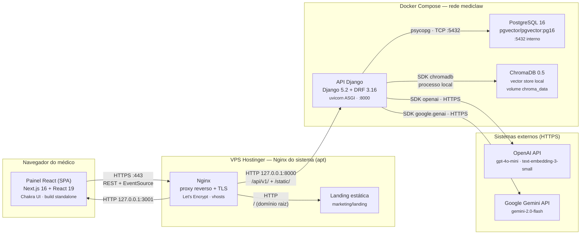

# Diagrama C4 — Containers (Nível 2) — MediClaw

> Gerado pelo **Arquiteto** em 2026-08-19.
> Escala de confiança: 🟢 CONFIRMADO | 🟡 INFERIDO | 🔴 LACUNA
> Topologia de produção conforme `docker-compose.prod.yml` + ADR-006.

## 1. Diagrama

## 2. Containers

### 2.1 Painel React

| Atributo | Valor | Evidência |
|---|---|---|
| Tecnologia | Next.js 16.2.4, React 19.2.4, TypeScript, Chakra UI 3, axios, react-markdown | `react-painel/package.json` 🟢 |
| Deploy | Dockerfile.prod, build **standalone** com `next build --webpack` | 🟢 |
| Publicação | `127.0.0.1:3001:3000` (porta 3000 ocupada por outro projeto no VPS) | `docker-compose.prod.yml` 🟢 |
| Acesso à API | `NEXT_PUBLIC_API_URL` (env no build) | 🟢 |
| Função | SPA: autenticação, chat (SSE), pacientes, logs, métricas admin, KB | `src/app/*` 🟢 |

### 2.2 API Django

| Atributo | Valor | Evidência |
|---|---|---|
| Tecnologia | Django 5.2.1 + DRF 3.16 + simplejwt + uvicorn (ASGI) | `pyproject.toml` 🟢 |
| Deploy | Dockerfile.prod; `entrypoint.prod.sh` | 🟢 |
| Publicação | `127.0.0.1:8000:8000` (só loopback) | 🟢 |
| Env | `django-api/.env.production` (env_file); `DB_HOST=postgres` | 🟢 |
| Função | REST `/api/v1/` + streaming SSE + health check + `/static/` | `config/urls.py` 🟢 |
| Observações | `SECURE_PROXY_SSL_HEADER`/`USE_X_FORWARDED_HOST` para operar atrás do Nginx (ADR-006); renderer de envelope global; structlog | 🟢 |

### 2.3 PostgreSQL

| Atributo | Valor | Evidência |
|---|---|---|
| Imagem | `pgvector/pgvector:pg16` (extensão pgvector pronta) | 🟢 |
| Persistência | volume nomeado `pgdata` | 🟢 |
| Exposição | **nenhuma** no host — só rede interna `mediclaw` | 🟢 |
| Healthcheck | `pg_isready` (5s/5s/10 retries) | 🟢 |

### 2.4 ChromaDB

| Atributo | Valor | Evidência |
|---|---|---|
| Tipo | **Biblioteca/processo local** do `ai_engine`/`rag` (não container próprio no compose prod) | `apps/rag/vector_store.py` 🟡 |
| Persistência | volume `chroma_data` montado em `/app/chroma_data` | 🟢 |
| Collection | `mediclaw_kb`; `space='l2'`; telemetria desativada | 🟢 |
| Healthcheck | `/health/` da API consulta `get_collection().count()` | 🟢 |

> **Observação (🟡):** o compose de produção não define um serviço ChromaDB separado; o vector store roda **dentro do processo da API Django** usando o diretório persistido `chroma_data`. O healthcheck usa o endpoint `GET /health/` da própria API.

### 2.5 Nginx (host)

| Atributo | Valor | Evidência |
|---|---|---|
| Tipo | Nginx do sistema (apt), **não containerizado** | ADR-006 🟢 |
| Vhosts | `mediclaw.com.br` (landing + painel), `api.mediclaw.com.br` (API), `painel.mediclaw.com.br` | `nginx/system/*.conf` 🟢 |
| TLS | Let's Encrypt gerido no host (`init-letsencrypt.sh`) | 🟢 |
| Compatibilidade | sintaxe `listen ... http2` (Nginx antigo do VPS; `http2 on;` não suportado) | commit `8a7faaf` 🟢 |
| Static | serve `/staticfiles/` direto do disco (bind mount) | `docker-compose.prod.yml` 🟢 |

## 3. Comunicação entre containers

| De | Para | Mecanismo | Notas |
|---|---|---|---|
| Nginx | Painel | HTTP `127.0.0.1:3001` | proxy reverso |
| Nginx | API | HTTP `127.0.0.1:8000` | proxy + `/static/` |
| Painel | API | HTTPS → Nginx → HTTP local | REST + EventSource (SSE) |
| API | PostgreSQL | TCP 5432 (rede interna) | Django ORM (psycopg) |
| API | ChromaDB | processo local (volume) | SDK chromadb |
| API | OpenAI/Gemini | HTTPS (SDK) | chat + embeddings |

## 4. Observações de arquitetura

- **Zero exposição de containers:** nada além do Nginx fala com a internet; as portas da API e do painel ficam em loopback (ADR-006). 🟢
- **ChromaDB dentro do processo API** é uma escolha de simplicidade do MVP; a migração para `pgvector` (banco externo) é prevista pós-MVP (ADR-005, Epic 9). 🟡
- **Sem fila/worker/cache:** não há Celery, Redis ou message broker — ingestão de KB e chamadas LLM rodam síncronas no request (dívida D16). 🟢
- **Sem CI/CD:** deploy manual via `deploy.sh` (git pull + testes + `docker compose build/up`). 🟢
