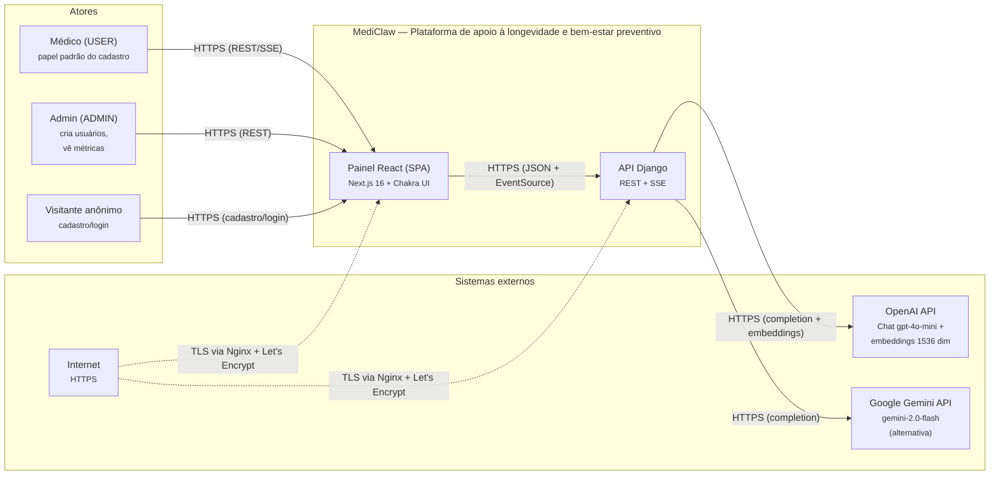

# Diagrama C4 — Contexto (Nível 1) — MediClaw

> Gerado pelo **Arquiteto** em 2026-08-19.
> Escala de confiança: 🟢 CONFIRMADO | 🟡 INFERIDO | 🔴 LACUNA

## 1. Diagrama

## 2. Atores

| Ator | Descrição | Evidência |
|---|---|---|
| **Médico (USER)** | Papel padrão no cadastro. Dona de pacientes, conversas e logs. Usa o chat para apoio clínico em consulta. | `ROLE_CHOICES = [USER, ADMIN]` 🟢 |
| **Admin (ADMIN)** | Papel elevado. Cria usuários e consulta métricas do dia. Não recebe conversa de boas-vindas. | `IsAdminRole`, `welcome.py:29` 🟢 |
| **Visitante anônimo** | Apenas `register`, `login`, `refresh` e `/health/`. | `AllowAny` nas rotas 🟢 |

> O **paciente não é um ator** — é uma entidade descrita pelo médico em terceira pessoa (`Patient`), sem login ou permissão própria. 🟢

## 3. Sistemas externos

| Sistema | Protocolo | Uso | Direção | Evidência |
|---|---|---|---|---|
| **OpenAI API** | HTTPS | Geração de chat (`gpt-4o-mini`) e embeddings (`text-embedding-3-small`, 1536 dim) | Saída | `providers/openai_provider.py`, `rag/ingestion.py` 🟢 |
| **Google Gemini API** | HTTPS | Geração de chat alternativa (`gemini-2.0-flash`) via `LLM_PROVIDER=gemini` | Saída | `providers/gemini_provider.py` 🟢 |
| **Nginx + Let's Encrypt** | HTTPS/HTTP | Proxy reverso no host e TLS (certificados no host, ADR-006) | Infra | `nginx/system/*.conf` 🟢 |
| **PostgreSQL 16** | TCP (rede Docker interna) | Banco relacional; imagem `pgvector/pgvector:pg16` (extensão pronta) | Saída | `docker-compose.prod.yml` 🟢 |
| **ChromaDB** | Processo local | Vector store do RAG (volume `chroma_data`) | Local | `apps/rag/vector_store.py` 🟢 |

> **Divergência de spec (🟡):** PROJECT-CONTEXT.md prevê **Anthropic** como provedor alternativo; o código implementa **OpenAI + Google Gemini**. Não há classe/credencial Anthropic.

## 4. Relacionamentos e protocolos

| De | Para | Protocolo | Descrição |
|---|---|---|---|
| Painel React | API Django | HTTPS/JSON + EventSource (SSE) | REST para CRUD; `GET /conversations/<id>/stream/` com `?token=` para streaming |
| API Django | OpenAI | HTTPS (SDK `openai`) | `complete`/`stream` (chat) e `embed_documents` (RAG) |
| API Django | Gemini | HTTPS (SDK `google.genai`) | `complete`/`stream` (chat) |
| API Django | PostgreSQL | TCP (psycopg) | Persistência relacional via Django ORM |
| API Django | ChromaDB | Processo local | Ingestão e retrieval de embeddings |
| Nginx | API Django / Painel | HTTP local (`127.0.0.1:8000` / `:3001`) | Proxy reverso; serve `staticfiles` do disco |

## 5. Observações

- **Autenticação do painel:** JWT Bearer (`Authorization: Bearer`); o refresh é gerido no cliente (interceptor Axios). O streaming usa access token no query string — **não passa por headers**, necessário ao `EventSource`. 🟡 exposição em access log.
- **TLS e publicidade:** apenas o Nginx do host fala com a internet; containers publicam portas só em loopback (ADR-006). 🟢
- **Banco:** `pgvector` está presente na imagem, mas o vector store do MVP é o **ChromaDB local**; a migração para `pgvector` é prevista pós-MVP (ADR-005, Epic 9). 🟢
