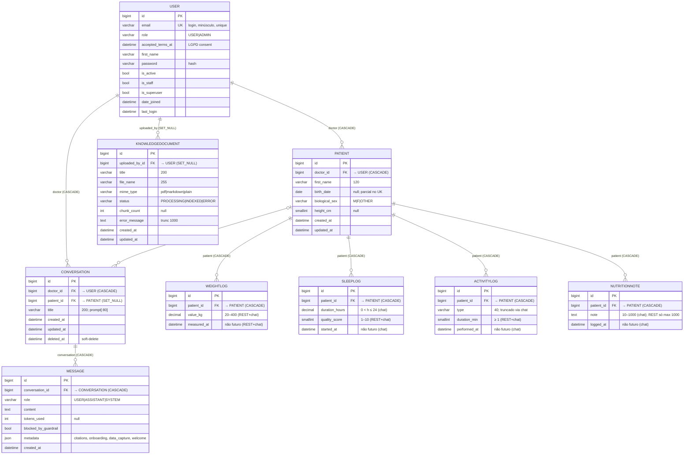

# ERD Completo — MediClaw

> Gerado pelo **Arquiteto** em 2026-08-19.
> Escala de confiança: 🟢 CONFIRMADO | 🟡 INFERIDO | 🔴 LACUNA
> Fonte: `data-dictionary.md` + `code-analysis.md` (migrations ORM). Cardinalidades e `on_delete` confirmados 🟢.

---

## 1. Diagrama ER



---

## 2. Tabelas e entidades

| Tabela | Modelo | Entidade | Registro | Append-only |
|---|---|---|---|---|
| `accounts_user` | `accounts.User` | Usuário/médico | sim | — |
| `patients_patient` | `patients.Patient` | Paciente | sim | — |
| `health_logs_weightlog` | `WeightLog` | Peso | sim | **sim** (GET/POST/DELETE) |
| `health_logs_sleeplog` | `SleepLog` | Sono | sim | **sim** |
| `health_logs_activitylog` | `ActivityLog` | Atividade | sim | **sim** |
| `health_logs_nutritionnote` | `NutritionNote` | Nutrição | sim | **sim** |
| `conversations_conversation` | `Conversation` | Conversa | sim (soft-delete) | — |
| `conversations_message` | `Message` | Mensagem | sim | — |
| `rag_knowledgedocument` | `KnowledgeDocument` | Doc. da KB | sim | — |
| *(ChromaDB)* | collection `mediclaw_kb` | Chunks + embeddings | persistência local | — |

> **Fora do Postgres:** os chunks do RAG vivem no ChromaDB (`documents`, `embeddings`, `metadatas` com `document_id`, `title`, `chunk_index`). 🟢

---

## 3. Chaves e relacionamentos

### 3.1 Relacionamentos com cardinalidade

| De | Para | Card. | FK | `on_delete` | Notas |
|---|---|---|---|---|---|
| `User` | `Patient` | 1 : N | `Patient.doctor_id` | CASCADE | `related_name="patients"` |
| `User` | `Conversation` | 1 : N | `Conversation.doctor_id` | CASCADE | `related_name="conversations"` |
| `User` | `KnowledgeDocument` | 1 : N | `KnowledgeDocument.uploaded_by_id` | SET_NULL | preserva doc se usuário deletado |
| `Patient` | `WeightLog` | 1 : N | `WeightLog.patient_id` | CASCADE | `related_name="weight_logs"` |
| `Patient` | `SleepLog` | 1 : N | `SleepLog.patient_id` | CASCADE | |
| `Patient` | `ActivityLog` | 1 : N | `ActivityLog.patient_id` | CASCADE | |
| `Patient` | `NutritionNote` | 1 : N | `NutritionNote.patient_id` | CASCADE | |
| `Patient` | `Conversation` | 1 : N | `Conversation.patient_id` | **SET_NULL** | conversa sobrevive ao paciente |
| `Conversation` | `Message` | 1 : N | `Message.conversation_id` | CASCADE | `related_name="messages"` |

### 3.2 Chaves únicas

| Tabela | Constraint | Escopo |
|---|---|---|
| `accounts_user.email` | `unique=True` (case-insensitive no lookup) | global |
| `patients_patient` | `(doctor_id, first_name, birth_date)` **parcial** | **somente quando** `birth_date IS NOT NULL` |

### 3.3 Índices

| Tabela | Índice | Motivo |
|---|---|---|
| `patients_patient` | `(doctor_id, first_name)` | filtro de listagem |
| `patients_patient` | `(doctor_id, created_at DESC)` | ordenação |
| `health_logs_weightlog` | `(patient_id, measured_at DESC)` | últimos pesos |
| `health_logs_sleeplog` | `(patient_id, started_at DESC)` | últimos sonos |
| `health_logs_activitylog` | `(patient_id, performed_at DESC)` | últimas atividades |
| `health_logs_nutritionnote` | `(patient_id, logged_at DESC)` | últimas notas |
| `conversations_conversation` | `(doctor_id, updated_at DESC)` | listagem de conversas |
| `conversations_conversation` | `(patient_id, updated_at DESC)` | conversas por paciente |
| `conversations_message` | `(conversation_id, created_at)` | histórico em ordem |

---

## 4. Regras de integridade (cascade LGPD)

A cadeia de exclusão do `User` (LGPD Art. 11 — dados sensíveis):

```
User.delete()
├── Patient.delete() (via doctor, CASCADE)
│   ├── WeightLog.delete() ×N
│   ├── SleepLog.delete() ×N
│   ├── ActivityLog.delete() ×N
│   └── NutritionNote.delete() ×N
│   └── Conversation.patient → SET_NULL (conversa sobrevive, patient vira NULL)
└── Conversation.delete() (via doctor, CASCADE)
    └── Message.delete() ×N
└── KnowledgeDocument.uploaded_by → SET_NULL (doc sobrevive sem dono)
```

> Deleção de `Patient` remove logs biométricos em cascata, mas **não** as conversas (SET_NULL). 🟢

---

## 5. Entidades sem tabela (estruturas em memória — `ai_engine`)

> O módulo `ai_engine` **não cria modelos ORM**. Estruturas internas (Pydantic v2/dataclasses/typing) documentadas em `data-dictionary.md`:

| Estrutura | Tipo | Papel |
|---|---|---|
| `GenerateResult` | dataclass | Saída do `generate()` |
| `GuardrailResult` | dataclass | Resultado do guardrail (allowed/reason/canned_reply) |
| `UserReadiness` | dataclass | Prontidão do perfil (derivada, não persistida) |
| `CaptureResult` | Pydantic | Resultado da captura de dados (saved/errors/still_missing) |
| `ExtractedUserData` + sub-modelos | Pydantic | Dados extraídos (profile, weight, sleep, activity, nutrition) |
| `ChatMessage` / `LLMProvider` | TypedDict / Protocol | Contrato de mensagens e provider |

---

## 6. Lacunas de modelo (🔴)

| Lacuna | Impacto | Evidência |
|---|---|---|
| **Sem `ActivityLog`** — `apps/audit` não tem models; `record()` é stub | Sem trilha de auditoria persistida | ADR-007, code-analysis (audit) 🔴 |
| **Sem job de expurgo/retenção (90 dias)** | Conversas soft-deletadas e antigas acumulam; sem purga | state-machines.md 🔴 |
| **Sem soft-delete em `Message`** | Mensagens de conversa deletada persistem até purga manual | code-analysis (conversations) 🔴 |
| **Sem reprocessamento de `KnowledgeDocument.ERROR`** | Correção só via re-upload | state-machines.md 🔴 |
