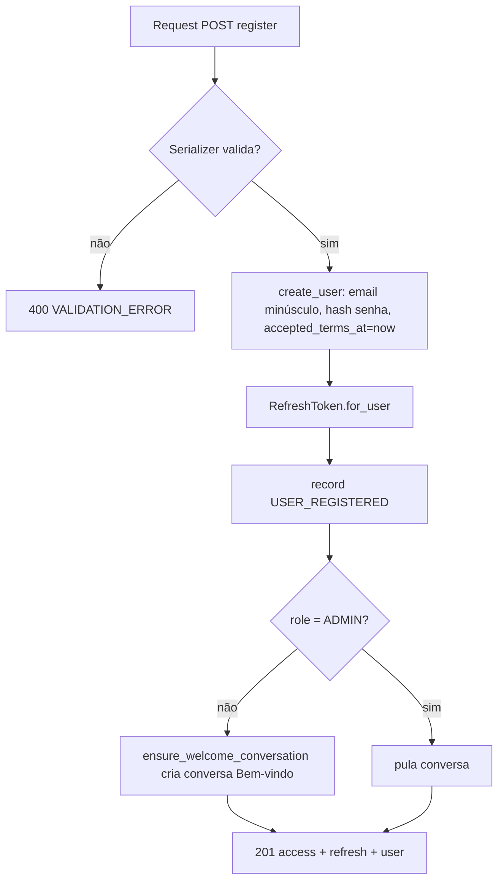
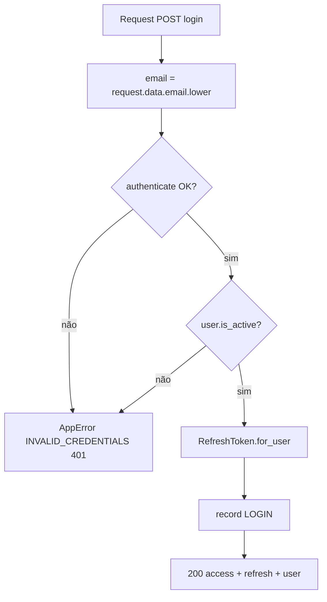
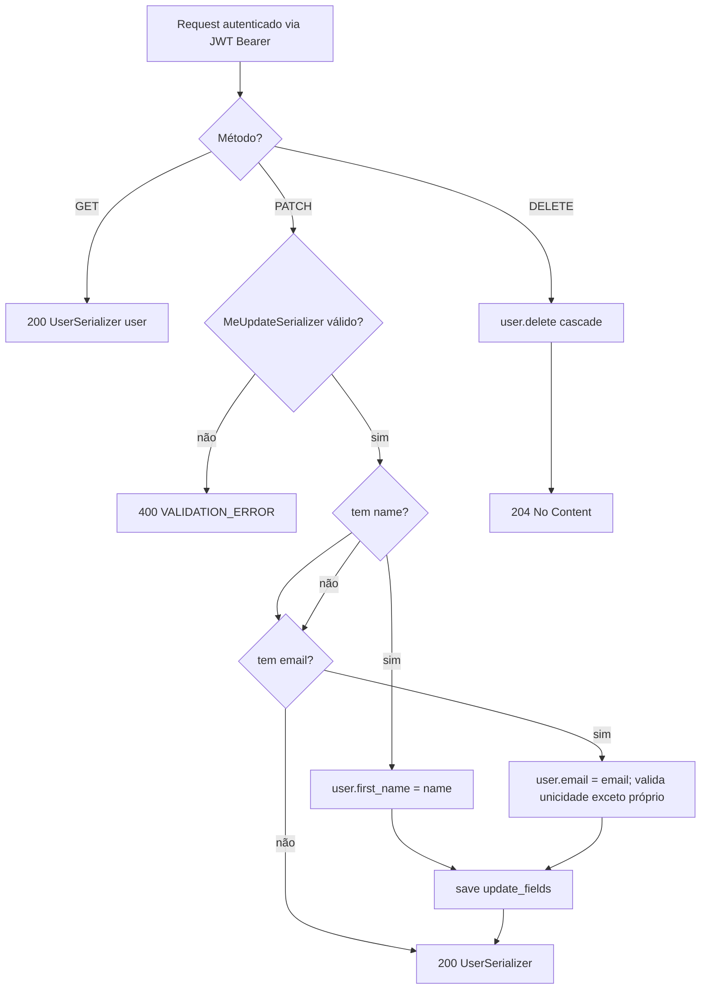
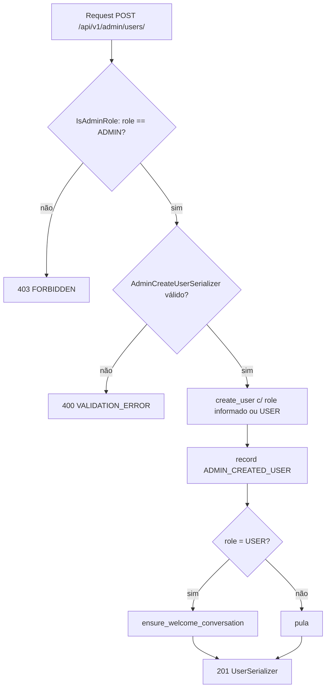
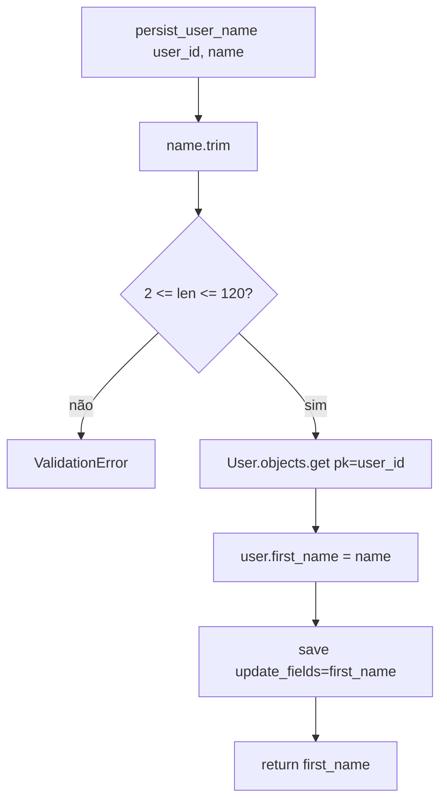

# Fluxogramas — accounts

> Gerado pelo **Arqueólogo** em 2026-08-19.
> Escala de confiança: 🟢 CONFIRMADO | 🟡 INFERIDO | 🔴 LACUNA

## 1. Register (POST `/api/v1/auth/register/`)

**Validações (RegisterSerializer):** senha ≥ 8 chars c/ letra e dígito 🟢 · `accept_terms` obrigatório 🟢 · email único (`iexact`) 🟢

## 2. Login (POST `/api/v1/auth/login/`)

**Observação:** falha de credencial e usuário inativo retornam o mesmo erro (não vaza qual campo está errado) 🟢

## 3. Me (GET/PATCH/DELETE `/api/v1/auth/me/`)

## 4. Admin cria usuário (POST `/api/v1/admin/users/`)

## 5. persist_user_name (service — captura de nome via chat)

