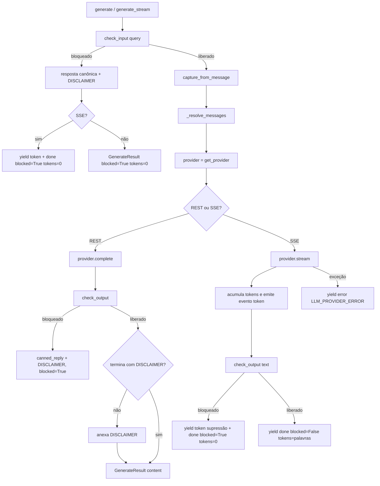
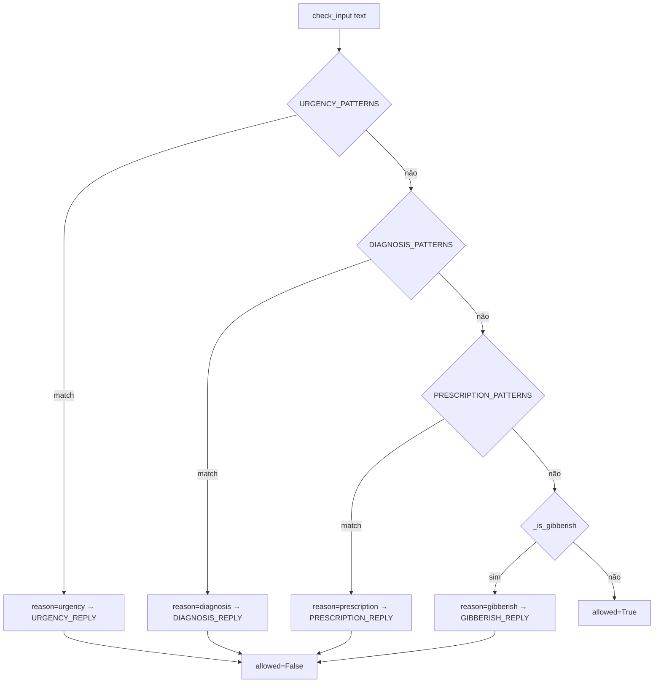
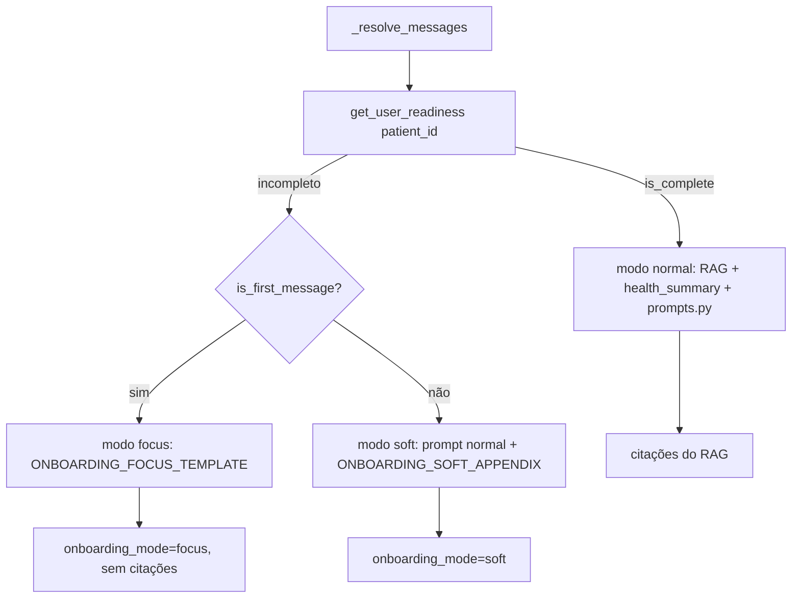
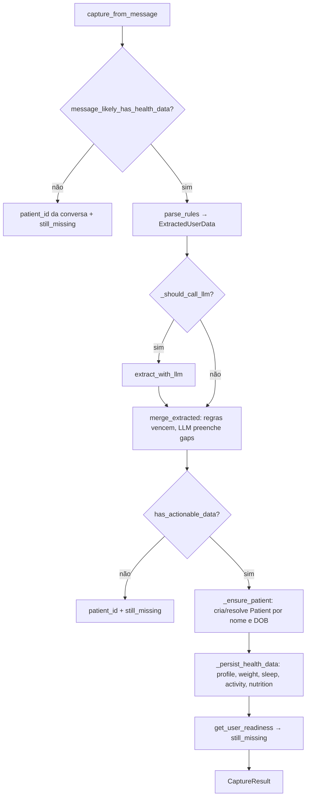
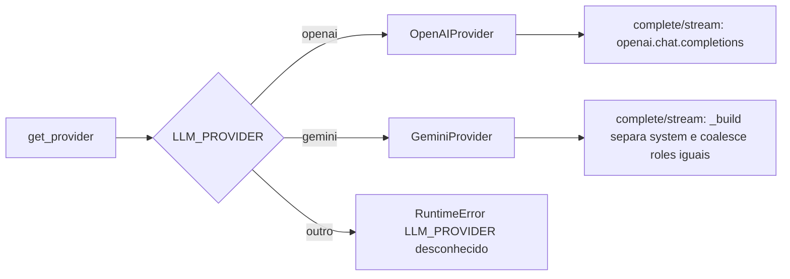

# Fluxograma — Módulo `ai_engine`

> Gerado pelo **Arqueólogo** em 2026-08-19.
> Escala de confiança: 🟢 CONFIRMADO | 🟡 INFERIDO | 🔴 LACUNA

---

## 1. Pipeline de geração (REST `generate` e SSE `generate_stream`)

> A entrada é sempre a mesma: `(user_id, conversation_id, query, is_first_message)`.
> Diferenças REST vs SSE: o REST retorna `GenerateResult`; o SSE emite eventos `citation` → `token*` → `done` (ou `error`).

---

## 2. Guardrail de entrada (`check_input`)

---

## 3. Onboarding — seleção de prompt (`_resolve_messages`)

---

## 4. Captura automática de dados do paciente (`capture_from_message`)

---

## 5. Providers — fábrica e coalescing do Gemini

