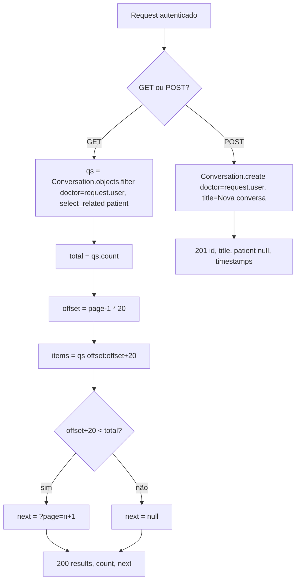
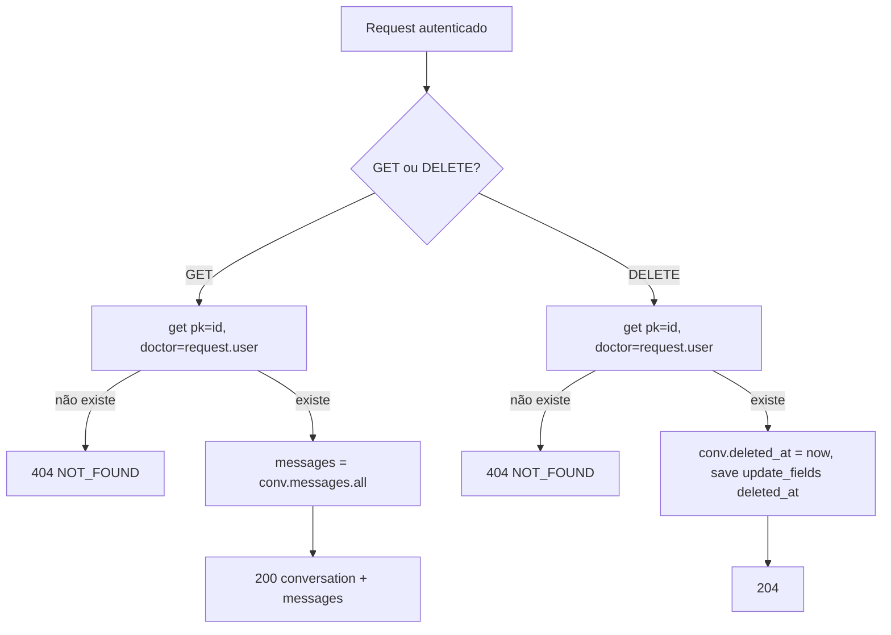
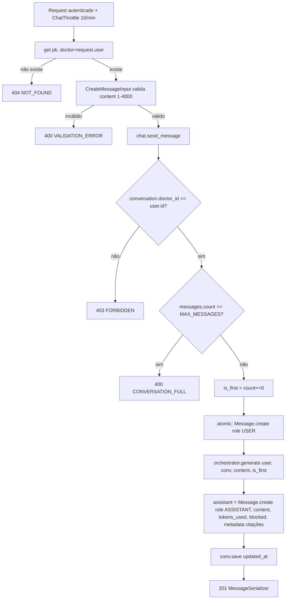
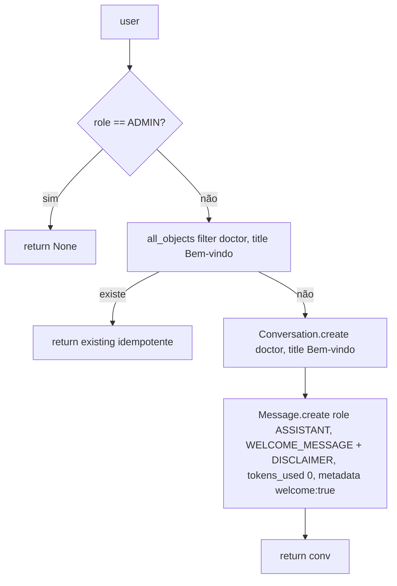

# Fluxogramas — conversations

> Gerado pelo **Arqueólogo** em 2026-08-19.
> Escala de confiança: 🟢 CONFIRMADO | 🟡 INFERIDO | 🔴 LACUNA

## 1. List / Create (GET/POST `/api/v1/conversations/`)



> Resposta envolta pelo `EnvelopeJSONRenderer` → `{data: {...}, error: null, meta: {}}`. 🟢

## 2. Detail / Delete (GET/DELETE `/api/v1/conversations/<id>/`)



> Soft delete: a linha some de `Conversation.objects` (manager exclui `deleted_at IS NOT NULL`), mas continua em `Conversation.all_objects`. 🟢

## 3. Post message (POST `/api/v1/conversations/<id>/messages/`)



> `MAX_MESSAGES` aqui vem do env `MAX_MESSAGES_PER_CONVERSATION` (chat.py:7), default 50. `CONVERSATION_FULL` é o código real lançado (documentado como `CONVERSATION_LIMIT_REACHED`). 🟢

## 4. Stream SSE (GET `/api/v1/conversations/<id>/stream/?token=&prompt=`)

```mermaid
flowchart TD
    A[GET stream] --> B{token?}
    B -- não --> B1[401 SSE UNAUTHORIZED Token ausente]
    B -- sim --> C[AccessToken token_str + User.get id=token.user_id]
    C -- inválido/erro --> C1[401 SSE UNAUTHORIZED Token inválido]
    C -- válido --> D{conversa do médico?}
    D -- não --> D1[404 SSE NOT_FOUND]
    D -- sim --> E{prompt não vazio?}
    E -- não --> E1[400 SSE VALIDATION_ERROR Prompt vazio]
    E -- sim --> F{messages.count >= MAX_MESSAGES 50?}
    F -- sim --> F1[400 SSE CONVERSATION_FULL]
    F -- não --> G[is_first = count==0]
    G --> H[Message.create role USER]
    H --> I{título vazio ou Nova conversa?}
    I -- sim --> J[title = prompt[:80], save]
    I -- não --> K[generate_stream user, conv, prompt, is_first]
    J --> K
    K --> L{evento}
    L -- token --> L1[acumula full_content, yield data:event]
    L -- citation --> L2[acumula citações, yield data:event]
    L -- done --> L3[tokens_used, blocked, onboarding, missing_basics, data_capture, patient...]
    L -- error --> L4[logger.warning stream_error, yield data:event]
    L1 --> K
    L2 --> K
    L3 --> M[Message.create role ASSISTANT content=join, tokens_used, blocked, metadata]
    L4 --> K
    M --> N[conv.save updated_at]
    N --> O[yield data:done]
```

> View Django pura (sem `@api_view`): não passa pelo renderer/exception handler/throttle do DRF. Erros são emitidos como eventos SSE com status HTTP correspondente. Headers: `Cache-Control: no-cache` e `X-Accel-Buffering: no`. 🟢

## 5. Boas-vindas (`ensure_welcome_conversation`)



> Mensagem estática, sem LLM. Chamado no cadastro (`accounts.views.register`). 🟢
