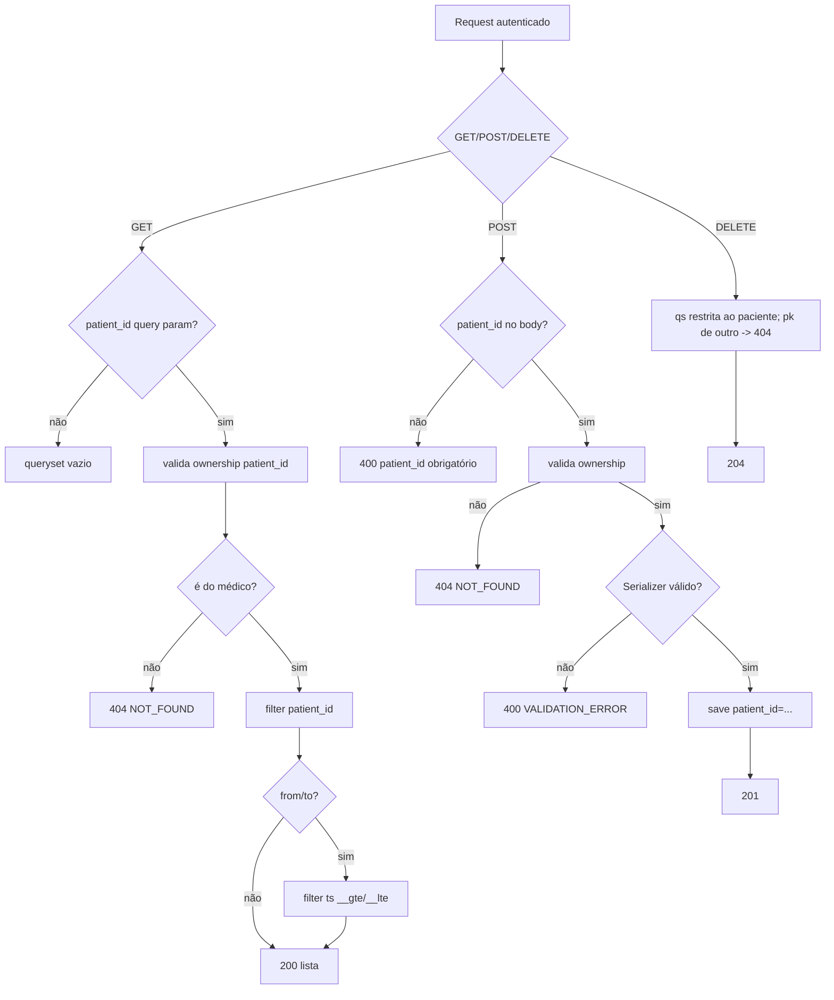
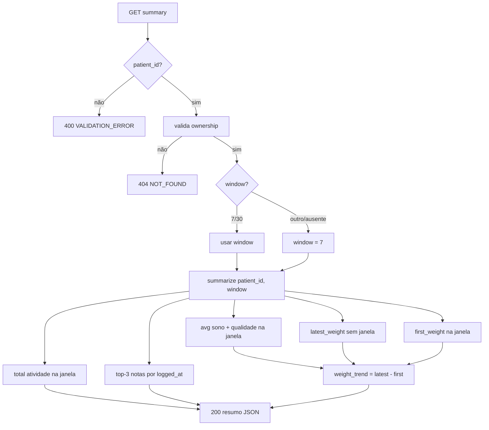
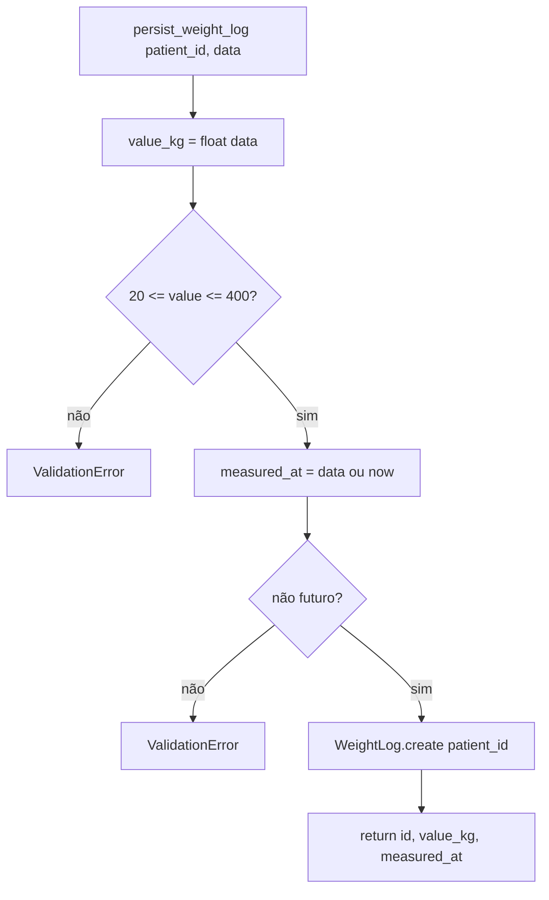

# Fluxogramas — health_logs

> Gerado pelo **Arqueólogo** em 2026-08-19.
> Escala de confiança: 🟢 CONFIRMADO | 🟡 INFERIDO | 🔴 LACUNA

## 1. CRUD via Viewset (GET/POST/DELETE — ex.: weight)

**Validações de serializer:** peso 20–400 🟢 · `measured_at` não futuro 🟢 · quality 1–10 🟢 · duration_min ≥ 1 🟢 · note ≤ 1000 🟢

## 2. Summary (GET `/api/v1/health/summary/`)

## 3. persist_weight_log (captura via chat — user_data_capture)

> `persist_sleep_log`, `persist_activity_log` e `persist_nutrition_note` seguem o mesmo padrão com regras próprias (sono: 0<h≤24 e quality 1–10 default 5 · atividade: duration_min≥1 e type obrigatório/truncado 40 · nutrição: 10≤len≤1000). Chamadas de `apps.ai_engine/services/user_data_capture.py`.
