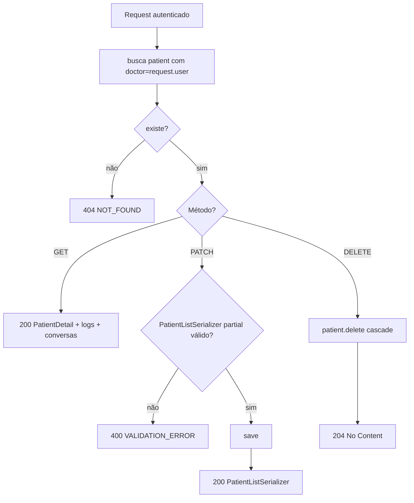
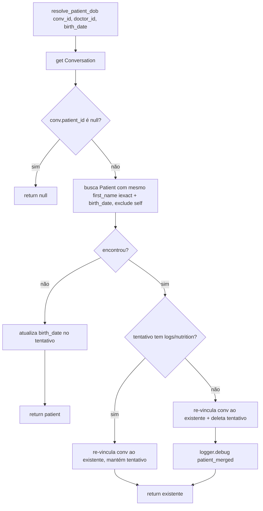

# Fluxogramas — patients

> Gerado pelo **Arqueólogo** em 2026-08-19.
> Escala de confiança: 🟢 CONFIRMADO | 🟡 INFERIDO | 🔴 LACUNA

## 1. Listar pacientes (GET `/api/v1/patients/`)

```mermaid
flowchart TD
    A[GET /patients] --> B[filter doctor=request.user]
    B --> C[_annotate_patients]
    C --> C1[conversation_count: Count não-deletadas]
    C --> C2[last_seen_at: Max updated_at não-deletadas]
    C --> C3[latest_weight_kg: Subquery top-1 por measured_at]
    C --> D[total = count]
    C --> E[items = qs[offset:offset+20]]
    E --> F{offset+20 < total?}
    F -- sim --> G[next = ?page=+1]
    F -- não --> H[next = null]
    D --> I[200 results + count + next]
```

## 2. Detalhe / edição / exclusão (GET/PATCH/DELETE `/api/v1/patients/<id>/`)



## 3. ensure_or_create_patient (captura de nome via chat)

```mermaid
flowchart TD
    A[ensure_or_create conv_id, doctor_id, first_name] --> B[get Conversation]
    B --> C{conv.patient_id existe?}
    C -- sim --> D{patient.first_name vazio?}
    D -- sim --> E[preenche first_name, save]
    D -- não --> F[retorna patient]
    E --> F
    C -- não --> G[Patient.create doctor_id + first_name.trim]
    G --> H[conv.patient = patient; conv.title = name[:120]]
    H --> I[save update_fields patient/title/updated_at]
    I --> J[logger.debug patient_created]
    J --> F
```

## 4. resolve_patient_dob (dedup ao capturar DOB)


