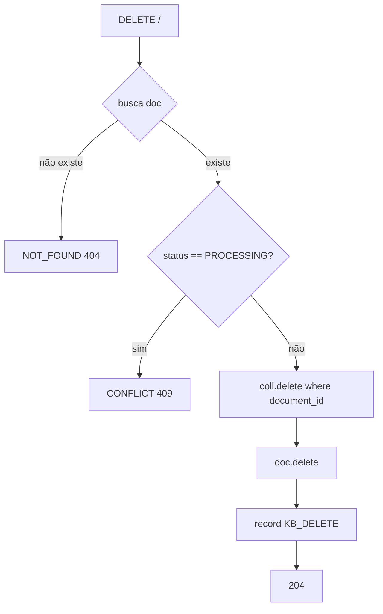
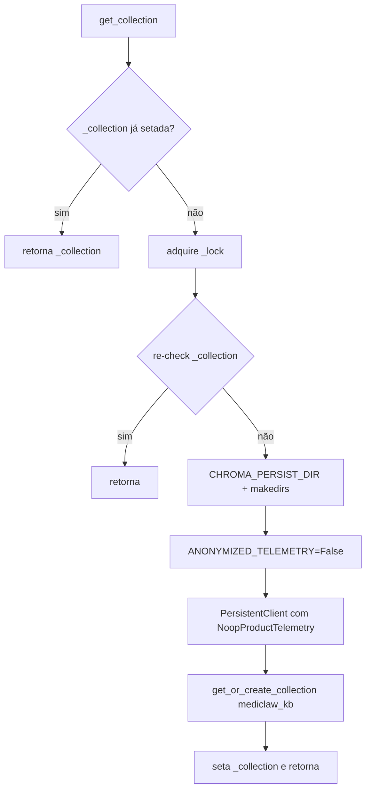

# Fluxograma — Módulo `rag`

> Gerado pelo **Arqueólogo** em 2026-08-19.
> Escala de confiança: 🟢 CONFIRMADO | 🟡 INFERIDO | 🔴 LACUNA

---

## 1. Upload + ingestão (`upload` → `ingest`)

```mermaid
flowchart TD
    A[POST upload/] --> B{arquivo presente?}
    B -- não --> B1[VALIDATION_ERROR 400]
    B -- sim --> C{size > 10MB?}
    C -- sim --> C1[FILE_TOO_LARGE 400]
    C -- não --> D{mime_type aceito?}
    D -- não --> D1[INVALID_FILE_TYPE 400]
    D -- sim --> E[cria KnowledgeDocument status=PROCESSING]
    E --> F[ingest doc, bytes]
    F --> G[_extract_text: PDF via pypdf / senão utf-8]
    G --> H{texto vazio?}
    H -- sim --> H1[ValueError]
    H -- não --> I[_split RecursiveCharacterTextSplitter 1000/200]
    I --> J[OpenAIEmbeddings.embed_documents]
    J --> K[get_collection.add ids + docs + embeddings + metadatas]
    K --> L[status=INDEXED, chunk_count=n]
    H1 --> M[status=ERROR, error_message=str(e)[:1000]]
    J -- exceção --> M
    L --> N[record KB_UPLOAD]
    N --> O[201 id/title/status/chunk_count]
    M --> N
```

---

## 2. Retrieval (`search`)

```mermaid
flowchart TD
    A[search query, k, min_score] --> B[get_collection]
    B --> C{count == 0?}
    C -- sim --> C1[retorna []]
    C -- não --> D[embed_query]
    D --> E[coll.query n_results=min(k, count)]
    E --> F[para cada chunk: score = max 0, 1 - dist/2]
    F --> G{score < min_score?}
    G -- sim --> G1[descarta]
    G -- não --> H[monta {content, source=title, chunk_id, document_id, score}]
    H --> I[lista ordenada por score desc]
    I --> J[retorna resultados]
    G1 --> F
```

> Note: o orquestrador chama `search(query, k=RAG_TOP_K=5, min_score=RAG_MIN_SCORE=0.75)`; o default da função é `min_score=0.40`.

---

## 3. Delete de documento



---

## 4. Singleton do vector store (`get_collection`)


