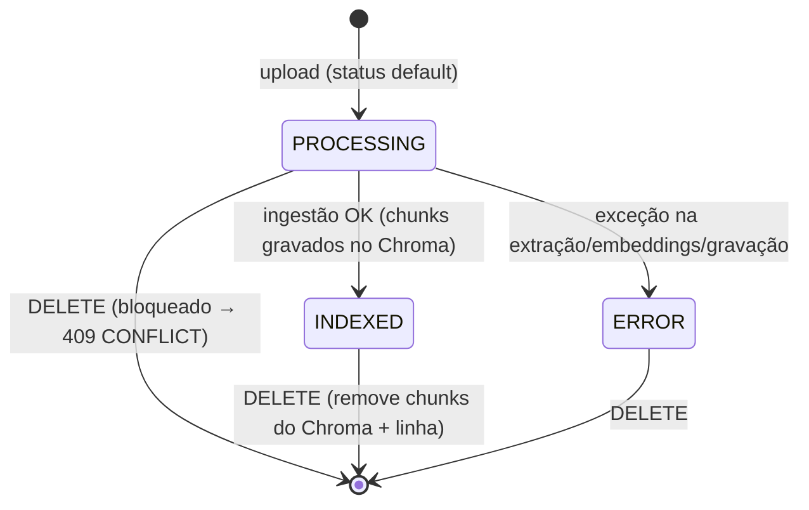
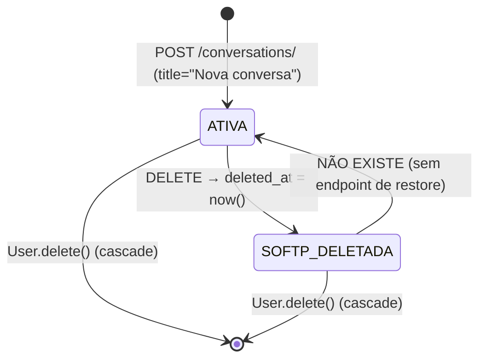
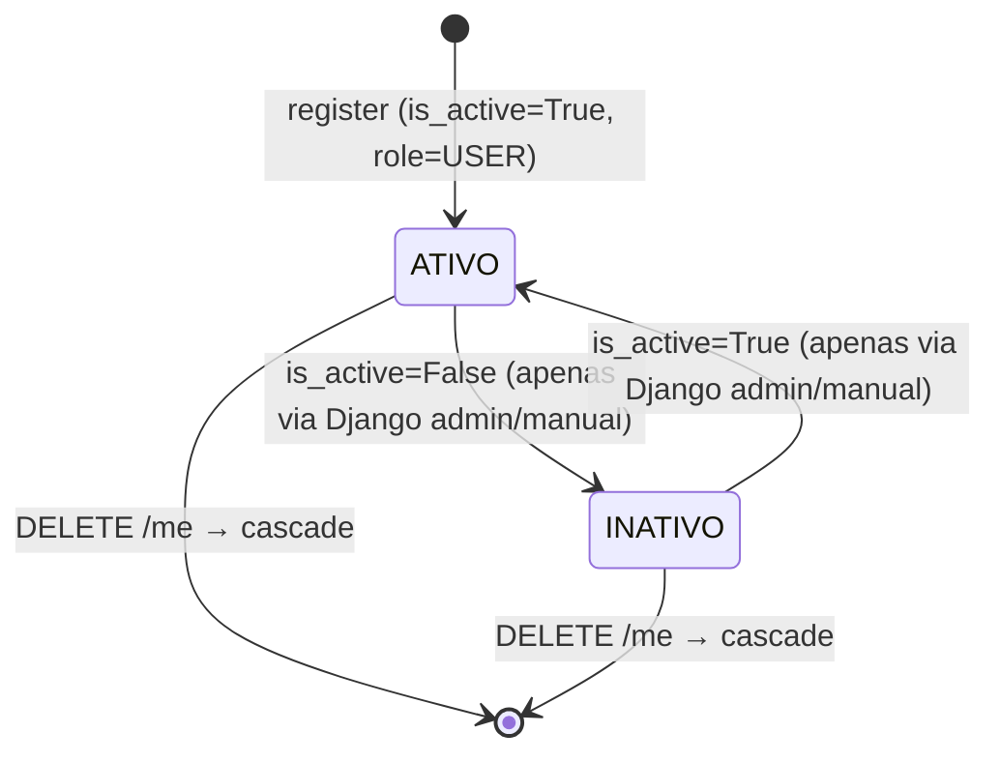
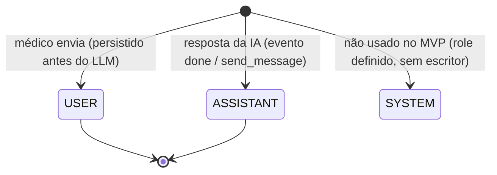
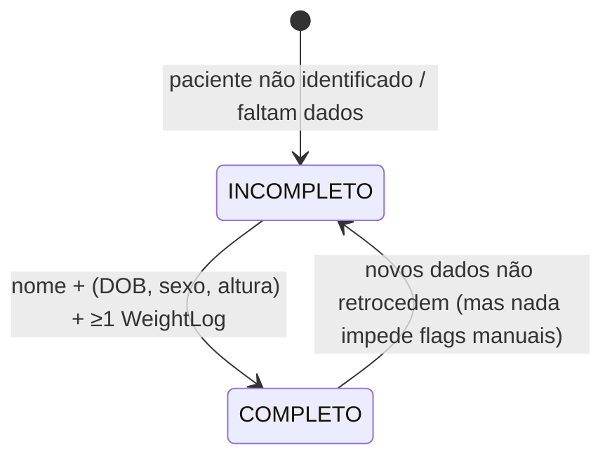
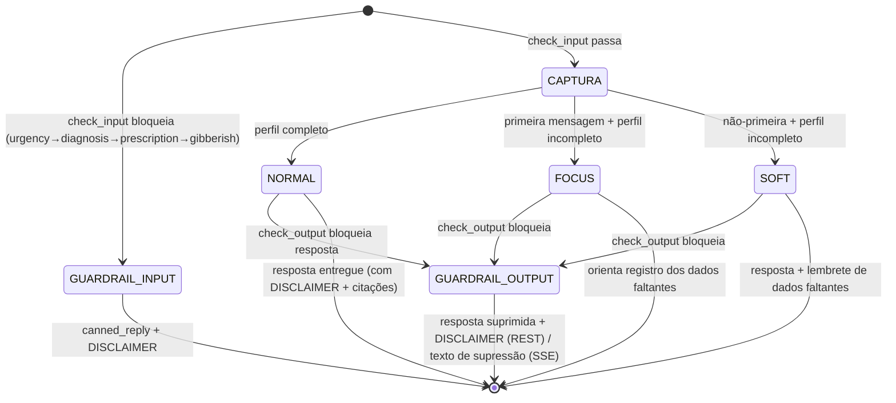

# Máquinas de Estado — MediClaw

> Gerado pelo **Detetive** em 2026-08-19.
> Escala de confiança: 🟢 CONFIRMADO | 🟡 INFERIDO | 🔴 LACUNA
> Artefato transversal — entidades com campo de status/estado e transições permitidas.

---

## 1. Visão geral

O sistema tem **poucas máquinas de estado persistidas**. A maioria dos "estados" é **derivada** (calculada a cada request), não armazenada. As entidades com estado próprio são:

| Entidade | Campo de estado | Persistido? | Tipo |
|---|---|---|---|
| `KnowledgeDocument` | `status` | Sim (`CharField`) | Clássico (PROCESSING→INDEXED\|ERROR) |
| `Conversation` | `deleted_at` | Sim (`DateTimeField`) | Soft-delete (1 transição) |
| `User` | `is_active`, `role` | Sim (herdado + próprio) | Flags de acesso |
| `Message` | `blocked_by_guardrail`, `role` | Sim | Flags de turno |
| `Patient` (perfil) | "prontidão" (`is_complete`) | **Não** — derivada de `UserReadiness` | Estado derivado |
| Turno de chat | modo de resposta (normal / focus / soft / guardrail) | Parcial (metadata) | Estado derivado |

---

## 2. `KnowledgeDocument.status` — ciclo de vida da indexação

**Fonte:** `apps/rag/models.py:6-10`, `apps/rag/ingestion.py:59-70`, `apps/rag/views.py:124-125` 🟢

**Regras de transição:**

| De | Para | Gatilho | Evidência |
|---|---|---|---|
| `PROCESSING` | `INDEXED` | `ingest()` conclui com sucesso; seta `chunk_count` | ingestion.py:59-64 🟢 |
| `PROCESSING` | `ERROR` | Exceção capturada; `error_message = str(e)[:1000]` | ingestion.py:66-70 🟢 |
| `PROCESSING` | *(deletado)* | **Bloqueado**: `DELETE` em PROCESSING → 409 `CONFLICT` | views.py:124-125 🟢 |
| `INDEXED` | *(deletado)* | `DELETE` → `coll.delete(where={"document_id": ...})` + `doc.delete()` | views.py:126-130 🟢 |
| `ERROR` | `INDEXED` | **Não existe** re-tentativa automática; re-upload gera novo documento | 🔴 LACUNA — sem retry/reprocessamento |

> Observação: não há transição `ERROR → PROCESSING` nem mecanismo de reprocessamento de documento com erro. A única rota de correção é deletar e reenviar. 🟡 INFERIDO.

---

## 3. `Conversation.deleted_at` — soft-delete

**Fonte:** `apps/conversations/models.py:5-10,28-31`, `views.py:89-92` 🟢

**Regras:**

| Transição | Gatilho | Evidência |
|---|---|---|
| `ativa → soft-deletada` | `DELETE /conversations/<id>/`; seta `deleted_at`; linha some da query padrão | views.py:89-92; models.py:9 🟢 |
| `soft-deletada → ativa` | **Inexistente** — não há restauração | 🔴 LACUNA |
| expurgo | **Inexistente** — não há job que remova conversas deletadas ou antigas | 🔴 LACUNA (retenção LGPD) |

> A mensagem `role="USER"` não é re-criada em soft-delete; mensagens persistem em cascata até purga (não implementada). 🟢

---

## 4. `User` — flags de acesso e papel

**Fonte:** `accounts/models.py:22-32` + `AbstractUser` 🟢

**Regras:**

| Aspecto | Regra | Evidência |
|---|---|---|
| Ativação | Cadastro cria usuário **ativo** por padrão | `AbstractUser.is_active` default True 🟢 |
| Desativação | Sem endpoint próprio — só via admin/flags. Login de inativo → `INVALID_CREDENTIALS` | views.py:43 🟢 |
| Papel | `role ∈ {USER, ADMIN}`; `USER` default; `ADMIN` cria superuser no `create_superuser` | models.py:23, 15-19 🟢 |
| Role é **fixo após cadastro** | Não há endpoint para promover/rebaixar role; só `AdminCreateUserSerializer` define na criação | serializers.py:63-67 🟢 |

> O papel não tem máquina de estado transicional — é um atributo imutável via API. 🔴 LACUNA: promoção de admin não é possível pela API no MVP.

---

## 5. `Message` — flags de turno (role e bloqueio)

**Fonte:** `conversations/models.py:41-58`, `orchestrator.py` 🟢

`Message.role` é um rótulo, não uma transição:

**Regras do turno:**

| Regra | Detalhe | Evidência |
|---|---|---|
| `blocked_by_guardrail` | `False` normal; `True` quando guardrail de entrada ou saída bloqueia; content = `canned_reply + DISCLAIMER`; `tokens_used=0` | orchestrator.py:191-201, 217-239 🟢 |
| Turno atômico | Mensagem USER criada em `transaction.atomic` **antes** da chamada LLM (LLM fora da transação) | services/chat.py:18-19 🟢 |
| `tokens_used` | REST usa `provider.usage.total_tokens`; streaming conta `len(text.split())` (palavras) — **divergência de métrica** | orchestrator.py:215, 331 🟡 |
| Boas-vindas | `role=ASSISTANT`, `tokens_used=0`, `metadata.welcome=true`, sem LLM | services/welcome.py:42-49 🟢 |

---

## 6. "Prontidão" do perfil do paciente — estado derivado

**Fonte:** `ai_engine/skills/user_readiness.py:42-78` 🟢

Não é persistido — é calculado a cada request e reavaliado após cada captura:

- **Completo** = `first_name` preenchido **e** `birth_date` **e** `biological_sex` **e** `height_cm` **e** ≥1 `WeightLog`. 🟢
- Determina o **modo de resposta da IA**: perfil completo → modo normal; incompleto + primeira mensagem → `focus`; incompleto + demais → `soft`. 🟢
- `still_missing` é exposto como metadata da resposta para o frontend orientar o registro. 🟢

---

## 7. Turno de chat — máquina de resposta da IA (fluxo de estado em tempo real)

**Fonte:** `ai_engine/orchestrator.py` 🟢

O modo de resposta não é persistido como enum, mas registrado em `Message.metadata.onboarding_mode` / `blocked_by_guardrail`:

**Ordem dos guardrails de entrada (primeiro match vence):** `urgency → diagnosis → prescription → gibberish`. 🟢

---

## 8. Resumo de lacunas de estado

| Lacuna | Impacto | Evidência |
|---|---|---|
| Sem reprocessamento de documento `ERROR` | Conhecimento da KB fica perdido até re-upload manual | rag/models.py, ingestion.py 🔴 |
| Sem restauração de conversa soft-deletada | Deleção é irreversível na UI | conversations/views.py:89-92 🔴 |
| Sem job de retenção/expurgo (90 dias) | Dados acumulam além do prazo LGPD | 🔴 |
| Sem promoção de role via API | Operação de admin depende de acesso manual ao banco/admin | accounts/serializers.py 🔴 |
| `tokens_used` no streaming mede palavras | Métrica de auditoria diverge entre REST e SSE | orchestrator.py 🟡 |
